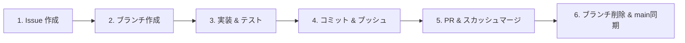

# 🌿 ONIWA 開発ガイドライン (Agent Protocol)

本ドキュメントは、本リポジトリ（`oniwa`）で作業を行うすべての AI エージェント（Antigravity、Gemini、Claude 等）および開発者が遵守すべき**行動規範・開発プロトコル**を定義します。

新規セッション開始時や別チャットでの作業時も、**必ず本プロトコルに従って自律的に作業を進めてください。**

---

## 1. コア設計思想（Core Philosophy）

- **脱データセンター・無断搾取なきオーガニック知性 (ONIWA)**:
  巨大GPUクラスタや無断スクレイピングデータに頼らず、クリーンなオープンデータと省電力エッジデバイス（Raspberry Pi 4等）で育成する小さな知性を目指す。
- **ピュア Rust 原則 (Pure Rust)**:
  Python、PyTorch、TensorFlow、CUDA などの外部 ML フレームワークへの依存は**一切禁止**。Transformer のすべての順伝播・逆伝播・オプティマイザ・熱制御・電力トラッキングをピュア Rust で完結させる。
- **出自の完全な透明性 (Provenance & Auditability)**:
  学習データ・ビルド・コミットハッシュ・重み SHA-256 チェックサムを監査台帳（`logs/ledger_index.jsonl`）に記録し、ブラックボックスを排除する。

---

## 2. 厳格な Issue ドリブン開発ワークフロー

すべての機能追加、バグ修正、リファクタリング、ドキュメント更新は、以下の **6段階のライフサイクル** を厳格に遵守して実行してください。



### ステップ 1: Issue 作成
作業着手前に、必ず GitHub Issue を作成します。
```bash
gh issue create --title "<type>: <簡潔な説明>" --body "## 概要\n...\n## 実装内容\n..."
```

### ステップ 2: ブランチ作成
Issue 番号と連動したブランチを作成・チェックアウトします。
- **ブランチ命名規則**: `{issue番号}/{type}/{kebab-case-description}`
  - `type` の例: `feat`, `fix`, `docs`, `refactor`, `perf`, `test`
  - 例: `7/feat/loss-modernization-label-smoothing-z-loss`
```bash
git checkout -b {issue番号}/{type}/{説明をケバブケースで}
```

### ステップ 3: 実装 & 検証
- 変更箇所のコードを実装します。
- **自動テストの全件通過を必ず確認**:
  ```bash
  cargo test --workspace
  ```
- 必要に応じて実機学習・推論バイナリの動作検証を実施:
  ```bash
  cargo run --release -p oniwa-lm --bin train -- --steps 1
  ```

### ステップ 4: コミット & プッシュ
- コミットメッセージには Conventional Commits プレフィックスと Issue 番号を含めます。
  - フォーマット: `<type>: <説明> (#<issue番号>)`
  - 例: `feat: 損失関数の近代化（Label Smoothing および Z-loss 正則化）の導入 (#7)`
```bash
git add <変更ファイル>
git commit -m "<type>: <説明> (#<issue番号>)"
git push -u origin {ブランチ名}
```

### ステップ 5: プルリクエスト作成 & スカッシュマージ
- `gh pr create` で PR を作成します（本文に `Closes #<issue番号>` を記載）。
- `gh pr merge --squash --delete-branch` でスカッシュマージを実行し、リモートブランチを自動削除します。
```bash
gh pr create --title "<type>: <説明>" --body "## 概要\nIssue #<番号> の対応です。\n...\n\nCloses #<番号>"
gh pr merge <PR番号> --squash --delete-branch
```

### ステップ 6: ブランチクリーンアップ & main 同期
- ローカルを `main` ブランチに戻し、最新のコミットを取得して作業ツリーをクリーンに保ちます。
```bash
git checkout main
git pull origin main
git fetch --prune
```

---

## 3. コーディング・実装上の重要ルール

1. **チェックポイントの後方互換性**:
   - `ModelConfig` やチェックポイント関連構造体を変更する際は、既存のチェックポイントが破損しないよう `#[serde(default)]` やフォールバック処理を徹底すること。
2. **Raspberry Pi 4 互換性と省電力**:
   - 行列演算やループ処理は CPU キャッシュ効率を意識し、不要なヒープ再アロケーションを避けること。
   - 熱制御（`thermal`）および消費電力積算（`power`）の計測ループを壊さないこと。
3. **テストの保守**:
   - 新機能追加時は、必ず対応するユニットテスト（数学的勾配チェック、構文スコア検証など）を同梱すること。
   - `cargo test --workspace` が常に 100% グリーンであることを維持すること。
