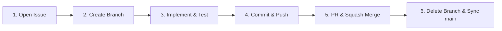

# 🌿 ONIWA Development Guidelines (Agent Protocol)

This document defines the **code of conduct and development protocol** to be strictly observed by all AI agents (Antigravity, Gemini, Claude, etc.) and developers working in this repository (`oniwa`).

When starting a new session or working in a separate chat context, **always adhere to this protocol autonomously.**

---

## 1. Core Philosophy

- **Organic Non-datacenter Intelligence Without Abuse (ONIWA)**:
  Cultivate small, autonomous intelligence using 100% provenance-audited clean open data on low-power edge hardware (such as Raspberry Pi 4), rejecting the power games of GPU clusters and non-consensual web scraping.
- **Pure Rust Principle**:
  Dependencies on external ML frameworks (Python, PyTorch, TensorFlow, CUDA, etc.) are **strictly prohibited**. All Transformer forward/backward passes, optimizers, thermal control, and power tracking must be implemented in Pure Rust.
- **100% Provenance & Auditability**:
  Record training data, build environments, commit hashes, and model weight SHA-256 checksums in the audit ledger (`logs/ledger_index.jsonl`) to completely eliminate black boxes.

---

## 2. Strict Issue-Driven Development Workflow

All feature additions, bug fixes, refactoring, and documentation updates must strictly follow this **6-stage lifecycle**:



### Step 1: Open an Issue
Before beginning any work, create a GitHub Issue:
```bash
gh issue create --title "<type>: <concise description in English>" --body "## Summary\n...\n## Scope of Changes\n..."
```

### Step 2: Create a Topic Branch
Create and check out a branch linked to the issue number:
- **Branch naming convention**: `{issue_number}/{type}/{kebab-case-description}`
  - Common `type` prefixes: `feat`, `fix`, `docs`, `refactor`, `perf`, `test`, `chore`
  - Example: `7/feat/loss-modernization-label-smoothing-z-loss`
```bash
git checkout -b {issue_number}/{type}/{kebab-case-description}
```

### Step 3: Implement & Verify
- Implement code changes.
- **Ensure all automated workspace tests pass**:
  ```bash
  cargo test --workspace
  ```
- Run formatting check and Clippy static analysis:
  ```bash
  cargo fmt --all -- --check
  cargo clippy --workspace --all-targets -- -D warnings
  ```
- Verify real training/inference execution if applicable:
  ```bash
  cargo run --release -p oniwa-lm --bin train -- --steps 1
  ```

### Step 4: Commit & Push
- Include a Conventional Commits prefix and the issue number in English:
  - Format: `<type>: <description in English> (#<issue_number>)`
  - Example: `feat: introduce label smoothing and z-loss regularization (#7)`
```bash
git add <files>
git commit -m "<type>: <description in English> (#<issue_number>)"
git push -u origin {branch_name}
```

### Step 5: Pull Request & Squash Merge
- Create a PR via `gh pr create` (include `Closes #<issue_number>` in the body).
- Perform a squash merge and delete the remote branch with `gh pr merge --squash --delete-branch`:
```bash
gh pr create --title "<type>: <description in English>" --body "## Summary\nResolves #<issue_number>.\n...\n\nCloses #<issue_number>"
gh pr merge <pr_number> --squash --delete-branch
```

### Step 6: Branch Cleanup & Sync main
- Return to the `main` branch, pull the latest commits, and keep the working tree clean:
```bash
git checkout main
git pull origin main
git fetch --prune
```

---

## 3. Key Implementation & Coding Rules

1. **Checkpoint Backward Compatibility**:
   - When modifying `ModelConfig` or checkpoint structures, always use `#[serde(default)]` and robust fallback handling so existing checkpoints remain readable.
2. **Raspberry Pi 4 Compatibility & Low Power**:
   - Optimize matrix multiplications and loops for CPU cache locality; minimize unnecessary heap allocations.
   - Never break or bypass thermal monitoring (`thermal`) or power telemetry (`power`).
3. **Test Integrity**:
   - Accompany new features with thorough unit tests (finite difference gradient checks, syntax scoring, tokenizer roundtrips, etc.).
   - Ensure `cargo test --workspace` remains 100% green at all times.
4. **Automated Formatting and Linting (Git Hooks)**:
   - A pre-commit hook in `.githooks/pre-commit` automatically runs `cargo fmt --all` and `cargo clippy --workspace --all-targets -- -D warnings` on staged files.
   - Always ensure Git hooks are enabled: `git config core.hooksPath .githooks`.
