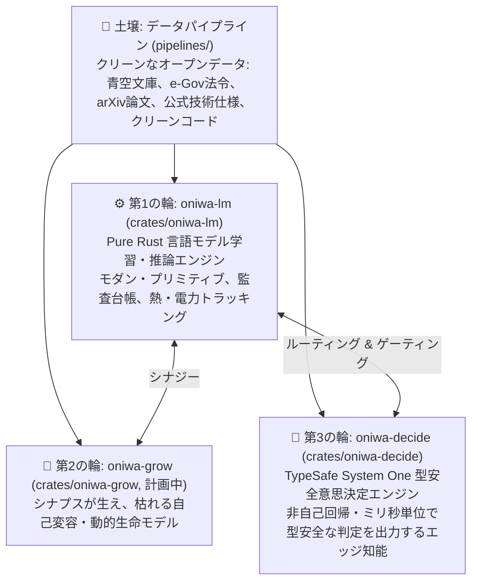

# ONIWA (お庭)

<p align="left">
  <b>日本語</b> | <a href="README.md">English</a>
</p>

<p align="left">
  <a href="https://github.com/KazutoMakino/oniwa/actions/workflows/ci.yml"></a>
  
  
  
</p>
<p align="left">
  
  
  
  
</p>

> **ONIWA: Organic Non-datacenter Intelligence Without Abuse**  
> — 家庭菜園としての知能、クリーンな土壌と自己変容するアーキテクチャ —

現代の生成AIにおける「GPU数万枚・パラメータ数千億のパワーゲーム」や「無断スクレイピング・合成データの泥沼」に対するアンチテーゼとして、出自が100%追跡可能なクリーンなデータのみを土壌とし、エッジ環境（Raspberry Pi等）でも掌握できる自作知能の育成を目指すプロジェクトです。

---

## 構想：3つの車輪と土壌



1. **第1の輪: `oniwa-lm` (`crates/oniwa-lm`)**
   - Pure Rust による極小言語モデル（SLM）学習・推論エンジン。
   - `llm.c` に着想を得つつ、RMSNorm, RoPE, SwiGLU, GQA 等のモダン・プリミティブを採用。
   - 決定論的再現性、完全監査台帳（Provenance Ledger）、消費電力・温度監視機能を内包。
2. **第2の輪: `oniwa-grow` (`crates/oniwa-grow`, 計画中)**
   - 固定サイズのネットワークではなく、刺激に応じてシナプスが生え、使われないノードが枯れる自己変容・動的生命モデル。
3. **第3の輪: `oniwa-decide` (`crates/oniwa-decide`)**
   - **TypeSafe AI「Jev」の System One 思想に着想を得た、ピュア Rust 製の型安全意思決定エンジン。**
   - テキスト生成（自己回帰）を行わず、入力テキストからプログラムが直接利用できる型安全な決定（`Choice`, `Score`, `Noul`）と較正された確信度（Confidence）を単一フォワードパス（ミリ秒単位・極小電力）で出力。
4. **土壌づくり: `pipelines/` (`oniwa-pipeline`)**
   - 青空文庫、e-Gov、国立国会図書館等のオープンデータからクリーンコーパスを精製するデータパイプライン。

---

## リポジトリ構成

本リポジトリは **Cargo Workspace** として構成されています。

```text
oniwa/
├── Cargo.toml                  # Workspace ルート設定 (crates/*, pipelines)
├── Cargo.lock
├── data/                       # [共通土壌] コーパス・語彙・トークンバイナリ
│   ├── raw/                    # ダウンロードキャッシュ (zip/txt)
│   ├── corpus/                 # クレンジング済み個別作品
│   ├── corpus_combined.txt     # 統合テキストコーパス
│   ├── vocab.json              # 共通文字語彙テーブル
│   └── tokens.bin              # 共通トークン列バイナリ
├── logs/                       # [共通台帳]
│   ├── ledger_index.jsonl      # データ系譜・推論・学習の統一監査台帳
│   └── growth_journal.md       # 観葉植物・生育観察日記
├── docs/                       # プロジェクト全体の思想・仕様書・詳細設計
├── pipelines/                  # [土壌づくり] データ収集・クレンジング・前処理クレート
│   ├── Cargo.toml              # (oniwa-pipeline)
│   ├── README.md
│   └── src/                    # 青空文庫クローラー、ルビ・注記除去、CLI
└── crates/
    ├── oniwa-lm/               # [種・エンジン] Pure Rust 言語モデルクレート
    │   ├── Cargo.toml
    │   ├── src/                # Transformerモデル、手動Autograd、学習・推論
    │   └── checkpoints/        # 学習チェックポイント
    └── oniwa-decide/           # [System One 決定エンジン] Pure Rust 型安全意思決定クレート
        ├── Cargo.toml
        ├── src/                # 双方向エンコーダ、Choice/Noul/Score決定ヘッド、較正
        └── checkpoints/        # 決定チェックポイント
```

---

## クイックスタート

### 0. 開発環境のセットアップ (Git Hook の有効化)
コミット時の自動コードフォーマット（`cargo fmt`）および Clippy による静的解析（`cargo clippy`）を行う Git フックが `.githooks` に同梱されています。クローン後に一度だけ以下を実行して有効化してください：
```bash
git config core.hooksPath .githooks
```

### 1. ビルド & テスト
```bash
cargo check --workspace
cargo test --workspace
```

### 2. 青空文庫パブリックドメイン・コーパスの自動収集 (`oniwa-pipeline`)
法・コンプライアンス（著作権満了作品のみ）を厳格に守り、代表的な名作群を自動取得・クレンジング・系譜記録します。
```bash
# 代表的な名作群（太宰治、芥川龍之介、中島敦、宮沢賢治、夏目漱石、森鴎外など）を一括収集 & コーパス生成
cargo run --release -p oniwa-pipeline -- --preset

# 特定の著者の著作権満了作品を片っ端から検索・追加収集
cargo run --release -p oniwa-pipeline -- --author "夏目漱石" --limit 5 --build

# 現在の収集状況と監査台帳の確認
cargo run --release -p oniwa-pipeline -- --status
```

### 3. 学習の実行
統合コーパス（複数作品）をもとに、本格Transformer（Self-Attention + RoPE + SwiGLU + Cosine LR Decay）で学習します。
```bash
# 基本実行 (500ステップ, プロンプト指定)
cargo run --release -p oniwa-lm --bin train -- --steps 500 --reset --prompt "メロスは、"

# カスタムプロンプトで言葉の成長を観察
cargo run --release -p oniwa-lm --bin train -- --steps 500 --prompt "李徴は、"

# 既存チェックポイントから追加で 100 ステップ継続学習
cargo run --release -p oniwa-lm --bin train -- --add-steps 100

# オプション:
#   --add-steps <N> : 現在のチェックポイントから追加学習するステップ数
#   --steps <N>     : 目標ステップ数 (指定値が現在以下の場合は自動で追加学習)
#   --prompt <text> : 途中観測プロンプト (デフォルト: "その時、")
#   --gen-len <N>   : 生成文字数 (デフォルト: 30)
#   --interval <N>  : 観測・ログ間隔 (デフォルト: 25)
#   --reset         : 既存チェックポイントを破棄して新規開始
#   --infinite, -i  : 無限学習ループ
```
学習中の生成文（言葉の芽吹き）は、**`logs/growth_journal.md`** に観葉植物の観察日記として自動記録されます。

### 4. バックグラウンド実行 & プロセス運用ガイド (遠隔・放置運用)

Raspberry Pi 4 に別PCから SSH 接続して学習させる場合、PC をシャットダウンしたり SSH を切断しても安全に学習を継続・監視・停止するためのコマンド一覧です。

#### ① バックグラウンド実行（SSH切断後も放置で継続）
事前に release ビルドしておき、`nohup` で起動します。
```bash
# 事前ビルド
cargo build --release -p oniwa-lm --bin train

# バックグラウンド実行開始（ログを train.log に書き出し、標準エラーも統合）
nohup target/release/train --infinite --interval 50 > train.log 2>&1 &
```
> [!TIP]
> **仮想端末（`screen`）を使う場合**:
> ```bash
> # screenセッションを作成して開始
> screen -S oniwa-train target/release/train --infinite --interval 50
> # デタッチ（セッションから抜ける）: Ctrl + A を押した後に D
> # 再アタッチ（再度画面に戻る）: screen -r oniwa-train
> ```

#### ② 稼働状態・プロセスの確認
```bash
# 実行中の学習プロセスの確認 (PIDとCPU使用率を表示)
ps aux | grep target/release/train | grep -v grep

# または pgrep でプロセス名とPIDを確認
pgrep -a train
```

#### ③ リアルタイム監視
```bash
# 出力ログをリアルタイムで追跡表示 (追跡終了は Ctrl + C)
tail -f train.log

# 直近の最新ログ50行を確認
tail -n 50 train.log

# 観葉植物・生育観察日記（成長記録）の確認
cat logs/growth_journal.md | tail -n 20
```

#### ④ 安全な学習停止（チェックポイント自動保存）
`oniwa-lm` は `SIGINT`（Ctrl+C シグナル）をキャッチして、**直前の重みとオプティマイザ状態を安全にチェックポイント（`checkpoints/latest`）へ保存してから終了**するように設計されています。
```bash
# 安全停止 (SIGINTシグナルを送信して保存終了)
pkill -SIGINT -f target/release/train

# 特定の PID を指定して停止する場合
kill -SIGINT <PID>
```
> [!WARNING]
> `kill -9 <PID>` (SIGKILL) は強制終了となり、チェックポイント保存処理がスキップされるため、通常は **必ず `kill -SIGINT` または `pkill -SIGINT`** を使用してください。

#### ⑤ ハードウェア状態・熱温度の確認
```bash
# Raspberry Pi の CPU 実温度を確認
vcgencmd measure_temp

# システム全体の負荷・メモリ確認
htop
```

### 5. インタラクティブ推論 (チャット)
```bash
cargo run --release -p oniwa-lm --bin chat
```

### 6. TypeSafe System One 型安全意思決定エンジン (`oniwa-decide`)

テキスト生成（自己回帰）を行わず、CPU 単体・ミリ秒単位で型安全な決定（`Choice`, `Noul`, `Score`）を出力します：

```bash
# 1. コードやテキストの型安全監査（Choice種別、Noul構文異常フラグ、Score複雑度を出力）
cargo run --release -p oniwa-decide --bin audit -- "fn main() { println!(\"Hello, oniwa-decide!\"); }"

# 2. 決定モデルの自己教師あり学習（熱制御・グリーン電力追跡付き）
cargo run --release -p oniwa-decide --bin train -- --steps 300 --seed 0

# 3. 既存チェックポイントからの積み増し継続学習 (+100ステップ)
cargo run --release -p oniwa-decide --bin train -- --add-steps 100
```

---

## ドキュメント

- [プロジェクト構想書（マニフェスト）](docs/00_oniwa-project-manifesto.ja.md) / [English](docs/00_oniwa-project-manifesto.md)
- [データ受け入れ憲章（Data Ingestion Charter）](docs/07_data_ingestion_charter.ja.md) / [English](docs/07_data_ingestion_charter.md)
- [環境負荷・グリーン電力トラッキング](docs/08_green_energy_and_power_tracking.ja.md) / [English](docs/08_green_energy_and_power_tracking.md)
- [監査台帳と温度管理仕様](docs/06_thermal_and_end_to_end_provenance.ja.md) / [English](docs/06_thermal_and_end_to_end_provenance.md)
- [oniwa-lm アーキテクチャ設計](docs/01_llm_c_architecture.ja.md) / [English](docs/01_llm_c_architecture.md)

---

## コミュニティ & コントリビューション

本プロジェクトはオープンソースコミュニティからの参加・改善を歓迎します！

- [コントリビューションガイド (CONTRIBUTING.ja.md)](CONTRIBUTING.ja.md) / [English](CONTRIBUTING.md)
- [AI エージェント開発プロトコル (AGENTS.ja.md)](AGENTS.ja.md) / [English](AGENTS.md)
- [行動規範 (CODE_OF_CONDUCT.ja.md)](CODE_OF_CONDUCT.ja.md) / [English](CODE_OF_CONDUCT.md)
- [セキュリティポリシー (SECURITY.ja.md)](SECURITY.ja.md) / [English](SECURITY.md)

---

## ライセンス (License)

本プロジェクトは **MIT License** のもとで公開されています。詳細は [LICENSE](LICENSE) を参照してください。
