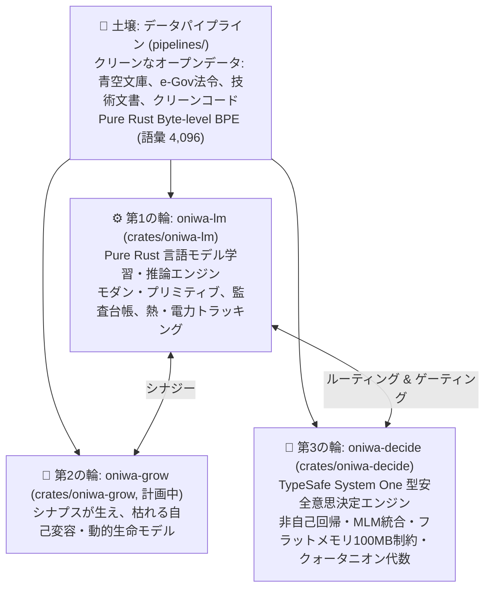

# ONIWA (お庭)

<p align="left">
  <b>日本語</b> | <a href="README.md">English</a>
</p>

<p align="left">
  <a href="https://github.com/KazutoMakino/oniwa/actions/workflows/ci.yml"></a>
  
  
  
</p>
<p align="left">
  
  
  
  
  
</p>

> **ONIWA: Organic Non-datacenter Intelligence Without Abuse**  
> — 家庭菜園としての知能、クリーンな土壌と自己変容するアーキテクチャ —

現代の生成AIにおける「GPU数万枚・パラメータ数千億のパワーゲーム」や「無断スクレイピング・合成データの泥沼」に対するアンチテーゼとして、出自が100%追跡可能なクリーンなデータのみを土壌とし、エッジ環境（Raspberry Pi 4等）でも掌握できる自作知能の育成を目指すプロジェクトです。

確定仕様およびシステム統合開発計画については、正本である [10. ONIWA 実用化ロードマップ仕様書 (System 1 & System 2 統合)](docs/10_system_integration_roadmap.ja.md) を参照してください。

---

## 構想：3つの車輪と土壌



1. **第1の輪: `oniwa-lm` (`crates/oniwa-lm`)**
   - Pure Rust による極小言語モデル（SLM）学習・推論エンジン。
   - `llm.c` に着想を得つつ、RMSNorm, RoPE, SwiGLU, GQA 等のモダン・プリミティブを採用。
   - 決定論的再現性、完全監査台帳（Provenance Ledger）、消費電力・温度監視機能を内包。
2. **第2の輪: `oniwa-grow` (`crates/oniwa-grow`, 計画中)**
   - 固定サイズのネットワークではなく、刺激に応じてシナプスが生え、使われないノードが枯れる自己変容・動的生命モデル。
3. **第3の輪: `oniwa-decide` (`crates/oniwa-decide`)**
   - **TypeSafe AI の System One 思想に着想を得た、ピュア Rust 製の型安全意思決定エンジン。**
   - テキスト生成（自己回帰）を行わず、入力テキストからプログラムが直接利用できる型安全な決定（`Choice`, `Score`, `Noul`）と較正された確信度（Confidence）を単一フォワードパス（ミリ秒単位・極小電力）で出力。
   - 厳格な **100MB メモリバジェット制約**、BERT型双方向 **MLM (Masked Language Modeling)** 復元ヘッド、キラーパターン検知、およびパラメータを圧縮する **クォータニオン代数（Hamilton積）** を統合。
4. **土壌づくり: `pipelines/` (`oniwa-pipeline`)**
   - 青空文庫、e-Gov、国立国会図書館等のオープンデータからクリーンコーパスを精製するデータパイプライン。
   - 外部依存ゼロの **Byte-level BPE（語彙サイズ 4,096）** 学習器（`train-bpe`）を同梱。

---

## リポジトリ構成

本リポジトリは **Cargo Workspace** として構成されています。

```text
oniwa/
├── Cargo.toml                  # Workspace ルート設定 (crates/*, pipelines)
├── Cargo.lock
├── data/                       # [共通土壌] コーパス・語彙・トークンバイナリ
│   ├── raw/                    # ダウンロードキャッシュ (zip/txt)
│   ├── corpus/                 # クレンジング済み個別作品
│   ├── corpus_combined.txt     # 統合テキストコーパス
│   ├── bpe_vocab.json          # Pure Rust Byte-level BPE語彙テーブル (4,096語彙)
│   ├── vocab.json              # 従来の文字語彙テーブル (後方互換用)
│   └── tokens.bin              # 共通トークン列バイナリ
├── logs/                       # [共通台帳]
│   ├── ledger_index.jsonl      # データ系譜・推論・学習の統一監査台帳
│   └── growth_journal.md       # 観葉植物・生育観察日記
├── docs/                       # プロジェクト全体の思想・ロードマップ・詳細設計
│   ├── 10_system_integration_roadmap.ja.md # [最新正本] 実用化・統合ロードマップ仕様書
│   └── 09_roadmap.ja.md        # 学術的クォータニオン研究ロードマップ
├── pipelines/                  # [土壌づくり] データ収集・クレンジング・前処理・BPE学習
│   ├── Cargo.toml              # (oniwa-pipeline)
│   ├── README.ja.md
│   └── src/                    # 青空文庫クローラー、ルビ除去、train-bpe
└── crates/
    ├── oniwa-lm/               # [種・エンジン] Pure Rust 言語モデルクレート
    │   ├── Cargo.toml
    │   ├── src/                # Transformerモデル、手動Autograd、学習・推論
    │   └── checkpoints/        # 学習チェックポイント
    └── oniwa-decide/           # [System One 決定エンジン] Pure Rust 型安全意思決定クレート
        ├── Cargo.toml
        ├── README.ja.md
        ├── src/                # 双方向エンコーダ、Choice/Noul/Scoreヘッド、MLM、クォータニオン
        └── checkpoints/        # 決定チェックポイント
```

---

## クイックスタート

### 0. 開発環境のセットアップ (Git Hook の有効化)
コミット時の自動コードフォーマット（`cargo fmt`）および Clippy による静的解析（`cargo clippy`）を行う Git フックが `.githooks` に同梱されています。クローン後に一度だけ以下を実行して有効化してください：
```bash
git config core.hooksPath .githooks
```

### 1. ビルド & テスト
```bash
cargo check --workspace
cargo test --workspace
```

### 2. コーパス収集 ＆ BPEトークナイザー学習 (`oniwa-pipeline`)
```bash
# 代表的な名作群（太宰治、芥川龍之介、中島敦、宮沢賢治、夏目漱石、森鴎外など）を一括収集 & 統合コーパス生成
cargo run --release -p oniwa-pipeline -- --preset

# e-Gov 基本法令オープンデータも含めて全収集
cargo run --release -p oniwa-pipeline -- --all

# 統合コーパスから 4,096 語彙の Pure Rust Byte-level BPE トークナイザーを学習
cargo run --release -p oniwa-pipeline --bin train-bpe -- --input data/corpus_combined.txt --vocab-size 4096 --output data/bpe_vocab.json

# 現在の収集状況と監査台帳の確認
cargo run --release -p oniwa-pipeline -- --status
```

### 3. 言語モデル学習の実行 (`oniwa-lm`)
統合コーパスをもとに、本格Transformer（Self-Attention + RoPE + SwiGLU + Cosine LR Decay + Label Smoothing + Z-loss）で学習します。
```bash
# 基本実行 (500ステップ, プロンプト指定)
cargo run --release -p oniwa-lm --bin train -- --steps 500 --reset --prompt "メロスは、"

# カスタムプロンプトで言葉の成長を観察
cargo run --release -p oniwa-lm --bin train -- --steps 500 --prompt "李徴は、"

# 既存チェックポイントから追加で 100 ステップ継続学習
cargo run --release -p oniwa-lm --bin train -- --add-steps 100
```
学習中の生成文（言葉の芽吹き）は、**`logs/growth_journal.md`**（日本語版: [`growth_journal.ja.md`](logs/growth_journal.ja.md)）に観葉植物の観察日記として自動記録されます。

### 4. TypeSafe System One 型安全意思決定エンジン (`oniwa-decide`)

テキスト生成（自己回帰）を行わず、CPU 単体・ミリ秒単位で型安全な決定（`Choice`, `Noul`, `Score`）を出力します。厳格な 100MB メモリ枠内で MLM 復元とキラーパターン検知を同時に学習できます：

```bash
# 1. コードやテキストの型安全監査（Choice種別、Noul構文異常フラグ、Score複雑度を出力）
cargo run --release -p oniwa-decide --bin audit -- "pub fn fibonacci(n: u64) -> u64 { ... }"

# 2. 決定モデルの自己教師ありマルチタスク学習（熱制御・グリーン電力追跡付き）
cargo run --release -p oniwa-decide --bin train -- --steps 300 --seed 42

# 3. BPE語彙（Phase 1）およびキラーパターン（Phase 2）を指定した学習
cargo run --release -p oniwa-decide --bin train -- --steps 500 --bpe data/bpe_vocab.json --data data/killer_patterns.jsonl

# 4. クォータニオンヘッド構成での学習
cargo run --release -p oniwa-decide --bin train -- --steps 300 --config quaternion_head

# 5. 既存チェックポイントからの積み増し継続学習 (+100ステップ)
cargo run --release -p oniwa-decide --bin train -- --add-steps 100
```

**型安全監査ターミナル実行例**:
```text
============================================================
 🧭 oniwa-decide: TypeSafe System One Decision Engine
============================================================
  💾 Loaded checkpoint: crates/oniwa-decide/checkpoints/best (Loss: 0.8798)

🔍 Input Text:
pub fn fibonacci(n: u64) -> u64 { if n <= 1 { n } else { fibonacci(n-1) + fibonacci(n-2) } }

⚡ Decision Output (Inference Latency: 519 ms on Raspberry Pi 4 CPU):
  1. 🏷️ Choice [Document Category]: RustCode (Confidence: 93.2%)
  2. ⚠️ Noul   [Syntax Anomaly]: Normal (False) (Anomaly Prob: 11.6%)
  3. 📊 Score  [Syntax Complexity]: 3.29 / 5.0 (Confidence: 91.6%)
============================================================
```

### 5. インタラクティブ推論 (チャット)
```bash
cargo run --release -p oniwa-lm --bin chat
```

### 6. バックグラウンド実行 & プロセス運用ガイド (遠隔・放置運用)
Raspberry Pi 4 に別PCから SSH 接続して学習させる場合、PC をシャットダウンしたり SSH を切断しても安全に学習を継続・監視・停止するためのコマンド一覧です。

```bash
# バックグラウンド実行開始
nohup target/release/train --infinite --interval 50 > train.log 2>&1 &

# プロセス稼働確認
pgrep -a train

# ログ監視
tail -f train.log

# 安全停止 (SIGINTシグナルを送信してチェックポイントを安全保存)
pkill -SIGINT -f target/release/train
```

---

## ドキュメント体系

- **[10. ONIWA 実用化ロードマップ仕様書 (System 1 × System 2 統合)](docs/10_system_integration_roadmap.ja.md)** / [English](docs/10_system_integration_roadmap.md) *(最新正本・SSoT)*
- [09. 学術的クォータニオン研究ロードマップ](docs/09_roadmap.ja.md) / [English](docs/09_roadmap.md) *(四元数基礎研究)*
- [プロジェクト構想書（マニフェスト）](docs/00_oniwa-project-manifesto.ja.md) / [English](docs/00_oniwa-project-manifesto.md)
- [データ受け入れ憲章（Data Ingestion Charter）](docs/07_data_ingestion_charter.ja.md) / [English](docs/07_data_ingestion_charter.md)
- [環境負荷・グリーン電力トラッキング](docs/08_green_energy_and_power_tracking.ja.md) / [English](docs/08_green_energy_and_power_tracking.md)
- [監査台帳と温度管理仕様](docs/06_thermal_and_end_to_end_provenance.ja.md) / [English](docs/06_thermal_and_end_to_end_provenance.md)
- [oniwa-lm アーキテクチャ設計](docs/01_llm_c_architecture.ja.md) / [English](docs/01_llm_c_architecture.md)
- [System One 仮説 設計ドキュメント](docs/design/system-one-hypotheses.ja.md) / [English](docs/design/system-one-hypotheses.md)
- [非可逆圧縮ベンチマーク実測レポート](docs/benchmarks/lossy-compression-report.ja.md) / [English](docs/benchmarks/lossy-compression-report.md)

---

## コミュニティ & コントリビューション

本プロジェクトはオープンソースコミュニティからの参加・改善を歓迎します！

- [コントリビューションガイド (CONTRIBUTING.ja.md)](CONTRIBUTING.ja.md) / [English](CONTRIBUTING.md)
- [AI エージェント開発プロトコル (AGENTS.ja.md)](AGENTS.ja.md) / [English](AGENTS.md)
- [行動規範 (CODE_OF_CONDUCT.ja.md)](CODE_OF_CONDUCT.ja.md) / [English](CODE_OF_CONDUCT.md)
- [セキュリティポリシー (SECURITY.ja.md)](SECURITY.ja.md) / [English](SECURITY.md)

---

## ライセンス (License)

本プロジェクトは **MIT License** のもとで公開されています。詳細は [LICENSE](LICENSE) を参照してください。
