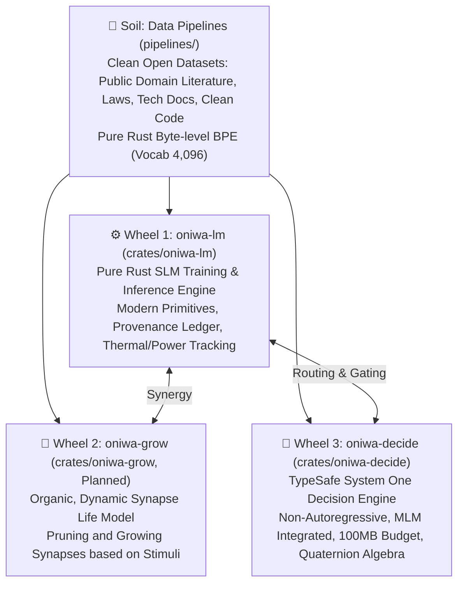

# ONIWA (お庭)

<p align="left">
  <b>English</b> | <a href="README.ja.md">日本語 (Japanese)</a>
</p>

<p align="left">
  <a href="https://github.com/KazutoMakino/oniwa/actions/workflows/ci.yml"></a>
  
  
  
</p>
<p align="left">
  
  
  
  
  
</p>

> **ONIWA: Organic Non-datacenter Intelligence Without Abuse**  
> *— Home garden intelligence: cultivated in clean soil with a self-transforming architecture —*

A counter-narrative to modern generative AI—which relies on power games of tens of thousands of GPUs, hundreds of billions of parameters, non-consensual web scraping, and synthetic data quagmires.  
**ONIWA** is a project to cultivate autonomous intelligence from scratch using only 100% provenance-audited clean open data on low-power edge hardware (such as Raspberry Pi 4).

For official specifications and system integration milestones, refer to the primary specification: [10. ONIWA Production Roadmap Specification (System 1 & System 2 Integration)](docs/10_system_integration_roadmap.md).

---

## Vision: Three Wheels and Soil



1. **Wheel 1: `oniwa-lm` (`crates/oniwa-lm`)**
   - Pure Rust Small Language Model (SLM) training & inference engine.
   - Inspired by `llm.c`, adopting modern transformer primitives: RMSNorm, RoPE, SwiGLU, and GQA.
   - Features deterministic reproducibility, tamper-proof provenance ledgers, real-time thermal throttling, and green energy power tracking.
2. **Wheel 2: `oniwa-grow` (`crates/oniwa-grow`, Planned)**
   - Instead of fixed-size matrices, an organic life model where synapses sprout in response to stimuli and unused pathways prune away naturally.
3. **Wheel 3: `oniwa-decide` (`crates/oniwa-decide`)**
   - **System One decision engine inspired by TypeSafe AI's Jev.**
   - Omits autoregressive text generation to provide **sub-100ms, ultra-low-power typed decisions** (`Choice`, `Score`, `Noul`) with calibrated confidence directly usable by software control flow.
   - Enforces a strict **100MB memory budget**, incorporates a BERT-style bidirectional **Masked Language Modeling (MLM)** head for killer pattern detection, and utilizes **quaternion algebra (Hamilton product)** for $4\times$ parameter compression.
4. **The Soil: `pipelines/` (`oniwa-pipeline`)**
   - Ethical crawling and dataset purification pipelines sourcing from Aozora Bunko (copyright-expired public domain literature), e-Gov law databases, official tech specifications, and clean open source code.
   - Includes zero-dependency **Byte-level BPE (vocabulary size 4,096)** training tool (`train-bpe`).

---

## Repository Structure

This repository is organized as a **Cargo Workspace**:

```text
oniwa/
├── Cargo.toml                  # Workspace root configuration (crates/*, pipelines)
├── Cargo.lock
├── data/                       # [Shared Soil] Corpus, vocabularies, token binaries
│   ├── raw/                    # Download cache (zip/txt)
│   ├── corpus/                 # Cleaned individual works
│   ├── corpus_combined.txt     # Combined text corpus
│   ├── bpe_vocab.json          # Pure Rust Byte-level BPE vocabulary table (4,096 tokens)
│   ├── vocab.json              # Legacy character vocabulary table (for backward compatibility)
│   └── tokens.bin              # Shared tokenized binary sequence
├── logs/                       # [Shared Ledger]
│   ├── ledger_index.jsonl      # Unified provenance audit ledger
│   └── growth_journal.md       # Plant growth observation journal
├── docs/                       # Project manifestos, specifications, and architecture
│   ├── 10_system_integration_roadmap.md # [Current SSoT] Production roadmap specification
│   └── 09_roadmap.md           # Academic quaternion research roadmap
├── pipelines/                  # [Soil Cultivation] Ingestion, cleaning & BPE training crate
│   ├── Cargo.toml              # (oniwa-pipeline)
│   ├── README.md
│   └── src/                    # Ethical crawlers, cleaners, train-bpe
└── crates/
    ├── oniwa-lm/               # [The Seed & Engine] Pure Rust SLM crate
    │   ├── Cargo.toml
    │   ├── src/                # Transformer models, manual Autograd, training loop
    │   └── checkpoints/        # Saved model checkpoints
    └── oniwa-decide/           # [System One Decision Engine] Pure Rust type-safe decision crate
        ├── Cargo.toml
        ├── README.md
        ├── src/                # Bidirectional encoder, Choice/Noul/Score heads, MLM, Quaternions
        └── checkpoints/        # Saved decision checkpoints
```

---

## Quickstart

### 0. Development Environment Setup (Git Hooks)
This repository includes a pre-commit Git hook for automated formatting (`cargo fmt`) and Clippy static analysis (`cargo clippy`). Enable it once after cloning:
```bash
git config core.hooksPath .githooks
```

### 1. Build & Test
```bash
cargo check --workspace
cargo test --workspace
```

### 2. Collect Clean Corpus & Train BPE Tokenizer (`oniwa-pipeline`)
Following strict legal clearance (only public domain and permissible open licenses), automatically download, clean, and extract BPE vocabulary:
```bash
# Ingest curated public domain masterpieces
cargo run --release -p oniwa-pipeline -- --preset

# Ingest all sources including e-Gov statutory texts
cargo run --release -p oniwa-pipeline -- --all

# Train pure-Rust Byte-level BPE tokenizer (4,096 tokens) on combined corpus
cargo run --release -p oniwa-pipeline --bin train-bpe -- --input data/corpus_combined.txt --vocab-size 4096 --output data/bpe_vocab.json

# Check current ingestion status and audit ledger
cargo run --release -p oniwa-pipeline -- --status
```

### 3. Run Language Model Training (`oniwa-lm`)
Train a modern Transformer model (Self-Attention + RoPE + SwiGLU + Cosine LR Decay + Label Smoothing + Z-loss) using the unified corpus:
```bash
# Basic training run (500 steps, starting with a custom observation prompt)
cargo run --release -p oniwa-lm --bin train -- --steps 500 --reset --prompt "メロスは、"

# Observe language germination with another prompt
cargo run --release -p oniwa-lm --bin train -- --steps 500 --prompt "李徴は、"

# Continue training for an additional 100 steps from existing checkpoints
cargo run --release -p oniwa-lm --bin train -- --add-steps 100
```
During training, generated text samples (the sprouting of words) are recorded automatically into **`logs/growth_journal.md`** (Japanese version: [`growth_journal.ja.md`](logs/growth_journal.ja.md)) as a garden growth journal.

### 4. TypeSafe System One Decision Engine (`oniwa-decide`)

Perform sub-100ms, non-autoregressive typed audits directly on your CPU without external GPU dependencies. Train with MLM and killer pattern detection within a 100MB memory envelope:

```bash
# 1. Audit a code snippet or text (returns Choice, Noul anomaly flag, and Score)
cargo run --release -p oniwa-decide --bin audit -- "pub fn fibonacci(n: u64) -> u64 { ... }"

# 2. Train decision model with self-supervised multi-task training & thermal/power tracking
cargo run --release -p oniwa-decide --bin train -- --steps 300 --seed 42

# 3. Train with BPE vocabulary (Phase 1) and killer patterns dataset (Phase 2)
cargo run --release -p oniwa-decide --bin train -- --steps 500 --bpe data/bpe_vocab.json --data data/killer_patterns.jsonl

# 4. Train with quaternion head configuration
cargo run --release -p oniwa-decide --bin train -- --steps 300 --config quaternion_head

# 5. Incrementally continue training from existing checkpoints (+100 steps)
cargo run --release -p oniwa-decide --bin train -- --add-steps 100
```

**Live Audit Output Example**:
```text
============================================================
 🧭 oniwa-decide: TypeSafe System One Decision Engine
============================================================
  💾 Loaded checkpoint: crates/oniwa-decide/checkpoints/best (Loss: 0.8798)

🔍 Input Text:
pub fn fibonacci(n: u64) -> u64 { if n <= 1 { n } else { fibonacci(n-1) + fibonacci(n-2) } }

⚡ Decision Output (Inference Latency: 519 ms on Raspberry Pi 4 CPU):
  1. 🏷️ Choice [Document Category]: RustCode (Confidence: 93.2%)
  2. ⚠️ Noul   [Syntax Anomaly]: Normal (False) (Anomaly Prob: 11.6%)
  3. 📊 Score  [Syntax Complexity]: 3.29 / 5.0 (Confidence: 91.6%)
============================================================
```

### 5. Interactive Inference (Chat REPL)
```bash
cargo run --release -p oniwa-lm --bin chat
```

### 6. Background Execution & Remote Process Management
When training remotely on a Raspberry Pi 4 via SSH, you can run training safely in the background:
```bash
# Start background process
nohup target/release/train --infinite --interval 50 > train.log 2>&1 &

# Check running process
pgrep -a train

# Monitor real-time logs
tail -f train.log

# Graceful stop (sends SIGINT to safely flush checkpoint before terminating)
pkill -SIGINT -f target/release/train
```

---

## Documentation System

- **[10. ONIWA Production Roadmap Specification (System 1 & System 2 Integration)](docs/10_system_integration_roadmap.md)** / [日本語](docs/10_system_integration_roadmap.ja.md) *(Current SSoT)*
- [09. Academic Quaternion Research Roadmap](docs/09_roadmap.md) / [日本語](docs/09_roadmap.ja.md) *(Quaternion Foundational Research)*
- [Project Manifesto](docs/00_oniwa-project-manifesto.md) / [日本語](docs/00_oniwa-project-manifesto.ja.md)
- [Data Ingestion Charter](docs/07_data_ingestion_charter.md) / [日本語](docs/07_data_ingestion_charter.ja.md)
- [Green Energy & Power Tracking](docs/08_green_energy_and_power_tracking.md) / [日本語](docs/08_green_energy_and_power_tracking.ja.md)
- [Provenance Ledger & Thermal Management](docs/06_thermal_and_end_to_end_provenance.md) / [日本語](docs/06_thermal_and_end_to_end_provenance.ja.md)
- [oniwa-lm Architecture Design](docs/01_llm_c_architecture.md) / [日本語](docs/01_llm_c_architecture.ja.md)
- [System One Hypotheses Design Doc](docs/design/system-one-hypotheses.md) / [日本語](docs/design/system-one-hypotheses.ja.md)
- [Lossy Compression Benchmark Report](docs/benchmarks/lossy-compression-report.md) / [日本語](docs/benchmarks/lossy-compression-report.ja.md)

---

## Community & Contributing

We warmly welcome contributions from the global open source community!

- [Contributing Guide](CONTRIBUTING.md) / [日本語](CONTRIBUTING.ja.md)
- [AI Agent Protocol (AGENTS.md)](AGENTS.md) / [日本語 (AGENTS.ja.md)](AGENTS.ja.md)
- [Code of Conduct](CODE_OF_CONDUCT.md) / [日本語](CODE_OF_CONDUCT.ja.md)
- [Security Policy](SECURITY.md) / [日本語](SECURITY.ja.md)

---

## License

This project is licensed under the **MIT License**. See the [LICENSE](LICENSE) file for details.
