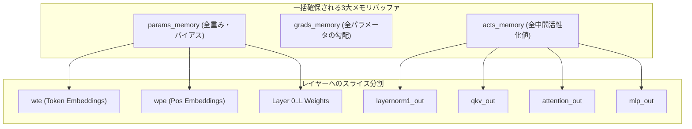

# Phase 1: llm.c の徹底分解（解体新書）

Andrej Karpathy 氏が手掛けた `llm.c` は、「巨大なフレームワーク（PyTorch等）や動的計算グラフを完全に排除し、プレーンな C / CUDA のみで GPT-2 の学習（事前学習）を実現した」ミニマリズムの極致です。

本ドキュメントでは、`llm.c` の核心である **「1枚バッファメモリモデル」「手動バックプロパゲーション規約」「データローダーとオプティマイザ」** を徹底的に分解し、Rustでの再設計に向けた知見を抽出します。

---

## 1. 静的一括メモリモデル（The Flat Buffer Paradigm）

一般的な機械学習フレームワーク（PyTorch等）は、演算のたびに動的にメモリを確保・解放（または内部のアロケータキャッシュを運用）します。
一方、`llm.c` は**「学習全体に必要なメモリを起動時にたった3つの巨大な連続領域（パラメータ、活性化値、勾配）として一括確保する」**という設計を採用しています。



### 1.1 パラメータ・メモリ (`params_memory`)
モデルの全重みを1本の連続した `float*` として `malloc` します。
モデル構造体内の各ポインタ（`wte`, `wpe`, `ln1w`, `qkvw` など）は、このバッファの**特定オフセットを指すだけのエイリアス**です。

```c
// llm.c のパラメータ確保イメージ
size_t num_parameters = ...;
float* params_memory = (float*)malloc(num_parameters * sizeof(float));

// オフセットをずらしながら各ポインタへ割り当て
float* ptr = params_memory;
model.wte = ptr; ptr += V * C;
model.wpe = ptr; ptr += maxT * C;
for (int l = 0; l < L; l++) {
    model.layers[l].ln1w = ptr; ptr += C;
    model.layers[l].ln1b = ptr; ptr += C;
    model.layers[l].qkvw = ptr; ptr += 3 * C * C;
    model.layers[l].qkvb = ptr; ptr += 3 * C;
    // ...
}
```

* **利点**:
  - メモリ断片化（Fragmentation）がゼロ。
  - チェックポイント保存・読み込みが単一の `fwrite` / `fread` で完了する。
  - オプティマイザ（AdamW）の更新処理が、構造に関係なく**単一の巨大な1次元配列に対するループ**として一瞬で処理できる。

### 1.2 活性化値メモリ (`acts_memory`)
逆伝播（Backward）を計算するには、順伝播（Forward）の途中で出力された中間テンソル（Activation）が必要です。
`llm.c` では、バッチサイズ $B$、系列長 $T$、レイヤー数 $L$、隠れ層次元 $C$ から**「学習1ステップで通過する全中間テンソルの総バイト数」**を厳密に計算し、事前に1つのバッファとして確保します。

```text
acts_memory の構成要素（一部）:
├── inputs       : (B, T)
├── targets      : (B, T)
├── encoded      : (B, T, C)
├── Layer 0:
│   ├── ln1      : (B, T, C)
│   ├── qkv      : (B, T, 3*C)
│   ├── att      : (B, NH, T, T)  <- 最もメモリを食う領域
│   ├── attproj  : (B, T, C)
│   ├── ln2      : (B, T, C)
│   └── mlp      : (B, T, 4*C)
├── ... (Layer 1 ~ L-1)
└── logits       : (B, T, V)
```

### 1.3 勾配メモリ (`grads_memory`)
`params_memory` と全く同じサイズ・同じレイアウトで確保されます。
各パラメータ $W$ に対応する $\frac{\partial L}{\partial W}$ を保持します。

---

## 2. 手動バックプロパゲーションの規約（Manual Autograd）

`llm.c` の最大の特徴は、**動的な計算グラフ（Autograd Graph）を作らない**ことです。
各層の数式を手作業で偏微分し、順伝播関数と逆伝播関数を1対1でペアとして実装しています。

### 2.1 関数シグネチャの規約
典型的なレイヤー（例：`layernorm`）のシグネチャは以下のようになっています。

```c
// 順伝播
void layernorm_forward(
    float* out,        // 出力活性化値バッファ (B, T, C)
    float* mean,       // 逆伝播で再利用する平均 (B, T)
    float* rstd,       // 逆伝播で再利用する分散の逆平方根 (B, T)
    const float* inp,  // 入力活性化値 (B, T, C)
    const float* weight,// パラメータ γ (C)
    const float* bias,  // パラメータ β (C)
    int B, int T, int C
);

// 逆伝播
void layernorm_backward(
    float* dinp,       // 入力に対する勾配 dL/dinp (B, T, C) を累積/代入
    float* dweight,    // 重みに対する勾配 dL/dweight (C) を累積
    float* dbias,      // バイアスに対する勾配 dL/dbias (C) を累積
    const float* dout, // 上流から流れてきた出力勾配 dL/dout (B, T, C)
    const float* inp,  // 順伝播の入力
    const float* mean, // 順伝播で保存した平均
    const float* rstd, // 順伝播で保存した rstd
    const float* weight,// パラメータ γ
    int B, int T, int C
);
```

### 2.2 逆伝播（Backward Pass）の実行順序
学習ループでは、順伝播で通ったパスを**完全に逆順**で手動実行します。

```text
[順伝播: Forward]
Embeddings -> LN1 -> QKV_Matmul -> Attention -> Att_Proj -> LN2 -> MLP -> LN_f -> Logits -> CrossEntropy(Loss)

[逆伝播: Backward]
dL/dLogits <- dCrossEntropy
  ↓
dLN_f <- dLogits_Matmul_Backward
  ↓
dMLP <- dLN2_Backward
  ↓
dAtt_Proj <- dAttention_Backward
  ... (全レイヤーを逆順に遡る)
  ↓
dEmbeddings
```

ポインタのライフタイムや所有権を意識する必要がなく、すべての入出力アドレスが決まっているため、キャッシュ局所性が極めて高くなります。

---

## 3. 周辺サブシステムの構造

### 3.1 オプティマイザ: `AdamW`
`llm.c` の AdamW は驚くほど短くシンプルです。
全パラメータが 1 次元の巨大バッファ `params_memory` に並んでいるため、レイヤーの形に関係なく、**全パラメータ数 $N$ のフラットなループを1回回すだけ**です。

```c
// llm.c の AdamW コアロジック (簡略化)
for (int i = 0; i < num_parameters; i++) {
    float param = params[i];
    float grad = grads[i];

    // 重み減衰 (Weight Decay)
    param -= lr * wd * param;

    // モーメンタム (m) と 二乗モーメンタム (v) の更新
    m[i] = beta1 * m[i] + (1.0f - beta1) * grad;
    v[i] = beta2 * v[i] + (1.0f - beta2) * grad * grad;

    // バイアス補正
    float m_hat = m[i] / (1.0f - beta1_t);
    float v_hat = v[i] / (1.0f - beta2_t);

    // パラメータ更新
    params[i] = param - (lr * m_hat) / (sqrtf(v_hat) + eps);
}
```

### 3.2 データローダー: `DataLoader`
複雑なPythonスクリプトやIPC（プロセス間通信）を使わず、前処理済みのトークンバイナリ（`uint16` または `uint32` のシーケンシャルなファイル）を直接 C 言語で読み込みます。

1. バイナリファイルのヘッダーからマジックナンバーと語彙サイズ、トークン総数を読み取る。
2. ファイルポインタから $B \times T$ 個のトークンを読み込んで `inputs` に代入。
3. 1トークン分ずらした $B \times T$ 個のトークンを `targets` に代入。
4. ファイル末尾に達したらシーク位置を先頭に戻す（エポック周回）。

---

## 4. Rustへの移植に向けた教訓と設計課題

`llm.c` を Rust に落とし込む際に考慮すべきポイント：

1. **ポインタ地獄の解消**:
   - C言語では `float* ptr = memory + offset;` で自由にポインタ演算をしますが、Rustでこれを直接やると `unsafe` だらけになります。
   - **Rust的解決策**: 1つの巨大な `Vec<f32>` を保持しつつ、各レイヤーには安全に切り分けたスライス `&[f32]`（順伝播用）や `&mut [f32]`（逆伝播書き込み用）を貸し出す**「アリーナ・アロケータ型」**のラッパーを設計するのが最も自然で安全です。
2. **中間状態のライフサイクル管理**:
   - `acts_memory` をレイヤー間で使い回す際、どの値が逆伝播まで生き残る必要があるかを型システムで明示できます。
3. **演算のモジュール化**:
   - `llm.c` のコードは1〜2ファイルに数千行詰め込まれており可読性が低いため、Rustでは `layers/` 単位にモジュールを分割しつつ、メモリのフラット性を維持するアーキテクチャを構築します。
