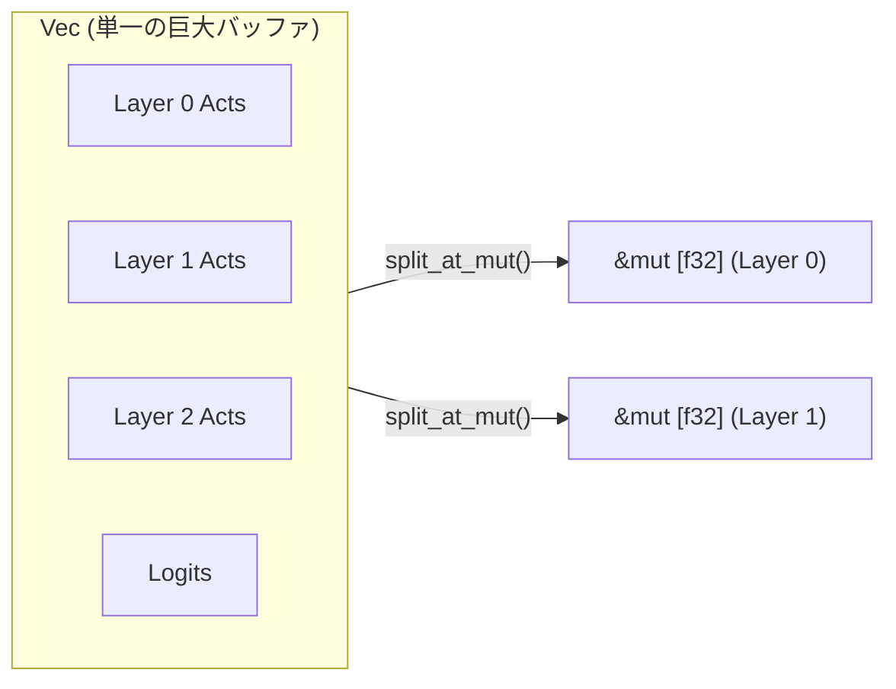

# Phase 3: Rustアーキテクチャと安全なフラットメモリ設計

`llm.c` の「1枚バッファ」による極限の高速性と、Rustの「所有権・ボローチェッカー」によるメモリ安全性をいかにして両立させるか――本ドキュメントでは、`niwa-lm` の核となる Rust アーキテクチャとメモリモデルの設計を定義します。

---

## 1. Rustにおける「1枚バッファ」の課題と解決策

### 1.1 なぜ素朴な実装だとボローチェッカーに弾かれるのか？
C言語では、1つの `float* memory` に対して以下のように自由にポインタを切り出せます。

```c
// C言語: エイリアシング規則を無視して自由に読み書き
float* out = memory + 0;
float* inp = memory + 1000;
matmul_forward(out, inp, ...);
```

しかし Rust では、**「1つの `Vec<f32>` から同時に複数の可変スライス（`&mut [f32]`）を取り出す」**、あるいは**「ある部分を不変参照（`&[f32]`）として読みながら別の部分を可変参照（`&mut [f32]`）として書き込む」** ことをボローチェッカーが厳格に禁止します（Aliasing XOR Mutability ルール）。

### 1.2 `niwa-lm` が採用する解決策：ブロック分割と安全なアリーナ

Rustの標準ライブラリには、まさにこのための安全なプリミティブが存在します。
それが **`split_at_mut`** です。



`split_at_mut` を使うことで、Rustコンパイラに対して「このスライスとあのスライスはメモリ上で絶対に重なっていない（Disjoint）」ことを型安全に証明できます。`unsafe` を一切使わずに、C言語同等のゼロオーバーヘッドなフラットバッファアクセスが可能です。

---

## 2. 16GB メモリ環境を前提としたリソース設計

引き継ぎ先のPC（RAM 16GB）で、スワップを発生させず快適に学習を回すためのモデルサイズ設計とメモリ試算式です。

### 2.1 推奨ターゲットサイズ（`niwa-small` / 家庭菜園モデル）
* **語彙サイズ ($V$)**: 8,192 〜 16,384（日本語BPE / SentencePiece）
* **系列長 ($T$)**: 512 〜 1,024 トークン
* **隠れ層次元 ($C$)**: 512
* **レイヤー数 ($L$)**: 8
* **ヘッド数 ($H_Q$)**: 8 (ヘッド次元 $d = 64$)
* **KVヘッド数 ($H_{KV}$)**: 2 ($G = 4$, GQA採用)
* **FFN中間次元 ($d_{\text{ffn}}$)**: $512 \times \frac{8}{3} \approx 1365$ (SwiGLUの黄金比)

### 2.2 メモリ見積もり（実測値シミュレーション）

| メモリ領域 | 計算式 | 概算サイズ (B=4, T=512) |
| :--- | :--- | :--- |
| **Params (`f32`)** | 総パラメータ数 $\approx 35\text{M}$ (3500万) | **約 140 MB** |
| **Gradients (`f32`)** | パラメータと同サイズ | **約 140 MB** |
| **Optimizer (`AdamW`)** | 1次モーメンタム $m$ + 2次モーメンタム $v$ ($2 \times \text{Params}$) | **約 280 MB** |
| **Activations (`f32`)** | 全レイヤーの中間値 ($L \times B \times T \times \dots$) | **約 350 MB** |
| **合計所要メモリ** | モデル学習全体 | **約 910 MB （1GB未満！）** |

> [!TIP]
> **16GB PC での余裕度**  
> 3,500万〜1億パラメータ程度のモデルであれば、**学習全体の所要メモリは 1GB 〜 3GB 程度** に収まります。  
> 16GB RAM のマシンであれば、OSやブラウザが起動した状態でも完全にオンメモリで高速に学習を完結できます。

---

## 3. モジュール構成とトレイト設計

`apps/niwa-lm` のディレクトリ構成と、各モジュールの役割です。

```text
apps/niwa-lm/
├── Cargo.toml
├── README.md
├── docs/
│   ├── 01_llm_c_architecture.md
│   ├── 02_modern_primitives.md
│   ├── 03_rust_memory_model.md
│   └── 04_development_handoff.md   # 他PCへの引き継ぎ手順書
└── src/
    ├── lib.rs
    ├── config.rs                   # ハイパーパラメータ・メモリサイズ計算
    ├── buffer.rs                   # フラットメモリバッファとスライス分割
    ├── ops/                        # 基本演算 (CPU / matrixmultiply)
    │   ├── matmul.rs
    │   └── softmax.rs
    ├── layers/                     # Modern Primitives (順伝播・逆伝播)
    │   ├── rmsnorm.rs
    │   ├── rope.rs
    │   ├── swiglu.rs
    │   └── attention.rs
    ├── model.rs                    # レイヤー結合・全体ループ
    ├── optim.rs                    # AdamW (1次元フラット更新)
    └── dataloader.rs               # トークンバイナリのメモリマップ供給
```

### 3.1 レイヤー共通のインターフェース設計規約
各レイヤーは、動的なグラフを持たず、**「入力スライス、パラメータスライス、出力スライス」** を受け取る純粋関数（またはステートレスな構造体）として定義します。

```rust
// 例: RMSNorm の関数シグネチャ規約
pub struct RMSNorm;

impl RMSNorm {
    /// 順伝播: out と rstd_cache に書き込む
    pub fn forward(
        out: &mut [f32],        // [B, T, C]
        rstd_cache: &mut [f32], // [B, T] (逆伝播で再利用)
        inp: &[f32],            // [B, T, C]
        weight: &[f32],         // [C]
        eps: f32,
    ) {
        // ...
    }

    /// 逆伝播: dinp と dweight に勾配を累積
    pub fn backward(
        dinp: &mut [f32],       // [B, T, C]
        dweight: &mut [f32],    // [C]
        dout: &[f32],           // [B, T, C]
        inp: &[f32],            // [B, T, C]
        rstd_cache: &[f32],     // [B, T]
        weight: &[f32],         // [C]
    ) {
        // ...
    }
}
```

この規約により、
1. メモリ割り当てが関数内部で一切発生しない（ゼロアロケーション）。
2. 単体テストでランダムなスライスを渡すだけで、数値微分による勾配チェックが即座に実行できる。
3. 将来 GPU（CUDA）版を追加する際も、同じシグネチャでバックエンドを切り替えられる。
