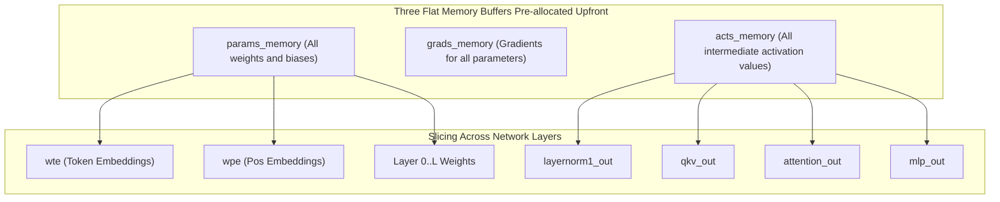

# Phase 1: In-Depth Deconstruction of llm.c

Andrej Karpathy's `llm.c` represents the pinnacle of minimalism: eliminating massive frameworks (PyTorch, etc.) and dynamic computational graphs entirely to realize GPT-2 pretraining using only plain C and CUDA.

This document dissects the core pillars of `llm.c`—the **Flat Buffer Memory Model**, the **Manual Autograd Convention**, and the **Data Loader and Optimizer**—to extract design insights for our Pure Rust architecture.

---

## 1. The Flat Buffer Paradigm

Standard machine learning frameworks (like PyTorch) dynamically allocate and free memory (or run internal allocator caches) during every tensor operation.
In contrast, `llm.c` allocates **all memory required for the entire training process upfront at startup as exactly three massive contiguous buffers (parameters, activations, gradients)**.



### 1.1 Parameter Memory (`params_memory`)
All model weights are `malloc`'d as a single continuous `float*` array.
Each pointer within the model struct (`wte`, `wpe`, `ln1w`, `qkvw`, etc.) is merely an **alias pointing to a specific offset in this buffer**.

```c
// Parameter allocation concept in llm.c
size_t num_parameters = ...;
float* params_memory = (float*)malloc(num_parameters * sizeof(float));

// Assign to pointers while advancing offsets
float* ptr = params_memory;
model.wte = ptr; ptr += V * C;
model.wpe = ptr; ptr += maxT * C;
for (int l = 0; l < L; l++) {
    model.layers[l].ln1w = ptr; ptr += C;
    model.layers[l].ln1b = ptr; ptr += C;
    model.layers[l].qkvw = ptr; ptr += 3 * C * C;
    model.layers[l].qkvb = ptr; ptr += 3 * C;
    // ...
}
```

* **Advantages**:
  - Zero memory fragmentation.
  - Checkpoint saving and loading completes in a single `fwrite` / `fread` call.
  - Optimizer updates (AdamW) execute as a single flat loop over a 1D array regardless of model depth or layer topology.

### 1.2 Activation Memory (`acts_memory`)
Computing the backward pass requires intermediate activations produced during forward propagation.
In `llm.c`, the exact byte size of all intermediate tensors passed during a single step is derived mathematically from batch size $B$, sequence length $T$, number of layers $L$, and hidden dimension $C$, then allocated upfront as a single buffer.

```text
acts_memory composition (sample):
├── inputs       : (B, T)
├── targets      : (B, T)
├── encoded      : (B, T, C)
├── Layer 0:
│   ├── ln1      : (B, T, C)
│   ├── qkv      : (B, T, 3*C)
│   ├── att      : (B, NH, T, T)  <- Peak memory footprint
│   ├── attproj  : (B, T, C)
│   ├── ln2      : (B, T, C)
│   └── mlp      : (B, T, 4*C)
├── ... (Layer 1 ~ L-1)
└── logits       : (B, T, V)
```

### 1.3 Gradient Memory (`grads_memory`)
Allocated with identical dimensions and layout to `params_memory`.
Stores $\frac{\partial L}{\partial W}$ corresponding to each parameter $W$.

---

## 2. Manual Autograd Convention

The most distinctive feature of `llm.c` is that it **builds no dynamic computational graph (Autograd Graph)**.
Every layer's analytical partial derivatives are hand-derived, pairing forward and backward functions 1:1.

### 2.1 Function Signature Conventions
A representative layer signature (e.g. `layernorm`):

```c
// Forward pass
void layernorm_forward(
    float* out,        // Output activations buffer (B, T, C)
    float* mean,       // Mean cached for backward pass (B, T)
    float* rstd,       // Reciprocal standard deviation cached for backward pass (B, T)
    const float* inp,  // Input activations (B, T, C)
    const float* weight,// Parameter gamma (C)
    const float* bias,  // Parameter beta (C)
    int B, int T, int C
);

// Backward pass
void layernorm_backward(
    float* dinp,       // Input gradient dL/dinp (B, T, C) accumulated or written
    float* dweight,    // Weight gradient dL/dweight (C) accumulated
    float* dbias,      // Bias gradient dL/dbias (C) accumulated
    const float* dout, // Upstream incoming gradient dL/dout (B, T, C)
    const float* inp,  // Cached forward input
    const float* mean, // Cached mean from forward pass
    const float* rstd, // Cached rstd from forward pass
    const float* weight,// Parameter gamma
    int B, int T, int C
);
```

### 2.2 Execution Order of the Backward Pass
The training loop runs the forward execution graph in **strictly reverse order**:

```text
[Forward Pass]
Embeddings -> LN1 -> QKV_Matmul -> Attention -> Att_Proj -> LN2 -> MLP -> LN_f -> Logits -> CrossEntropy(Loss)

[Backward Pass]
dL/dLogits <- dCrossEntropy
  ↓
dLN_f <- dLogits_Matmul_Backward
  ↓
dMLP <- dLN2_Backward
  ↓
dAtt_Proj <- dAttention_Backward
  ... (Traversing backwards across all layers)
  ↓
dEmbeddings
```

Because every buffer location is determined upfront with zero allocation overhead, CPU cache locality is exceptionally high.

---

## 3. Subsystem Architecture

### 3.1 Optimizer: `AdamW`
The AdamW optimizer in `llm.c` is remarkably concise.
Because all parameters are flattened across `params_memory`, the update step is just a **single flat loop over the total parameter count $N$**:

```c
// AdamW core logic in llm.c (simplified)
for (int i = 0; i < num_parameters; i++) {
    float param = params[i];
    float grad = grads[i];

    // Weight Decay
    param -= lr * wd * param;

    // Update biased first and second moment estimates
    m[i] = beta1 * m[i] + (1.0f - beta1) * grad;
    v[i] = beta2 * v[i] + (1.0f - beta2) * grad * grad;

    // Compute bias-corrected moments
    float m_hat = m[i] / (1.0f - beta1_t);
    float v_hat = v[i] / (1.0f - beta2_t);

    // Update parameter
    params[i] = param - (lr * m_hat) / (sqrtf(v_hat) + eps);
}
```

### 3.2 Data Loader: `DataLoader`
Rather than relying on external Python runtimes or inter-process communication (IPC), tokenized binary files (`uint16` or `uint32` sequential arrays) are streamed directly in C:

1. Read header magic numbers, vocabulary size, and total token count from the binary file header.
2. Read $B \times T$ tokens into `inputs`.
3. Read the next $B \times T$ tokens offset by 1 into `targets`.
4. Wrap file pointer back to the beginning upon reaching EOF (epoch cycling).

---

## 4. Architectural Lessons for Pure Rust Porting

Key architectural takeaways when implementing this philosophy in Rust:

1. **Eliminating Raw Pointer Fragility**:
   - In C, pointer arithmetic like `float* ptr = memory + offset;` is ubiquitous, but doing this naively in Rust leads to `unsafe` bloat.
   - **Idiomatic Rust Solution**: Maintain flat `Vec<f32>` arrays while lending safe slices `&[f32]` for forward evaluation and `&mut [f32]` for backward updates.
2. **Intermediate State Lifecycle Management**:
   - Explicitly enforce which activation tensors must persist until backward propagation via compile-time types or structured state structs.
3. **Modular Layer Decomposition**:
   - While `llm.c` condenses thousands of lines into one or two files, Rust enables modular division across `layers/` (Attention, MLP, RMSNorm) while preserving zero-allocation flat buffer performance.
