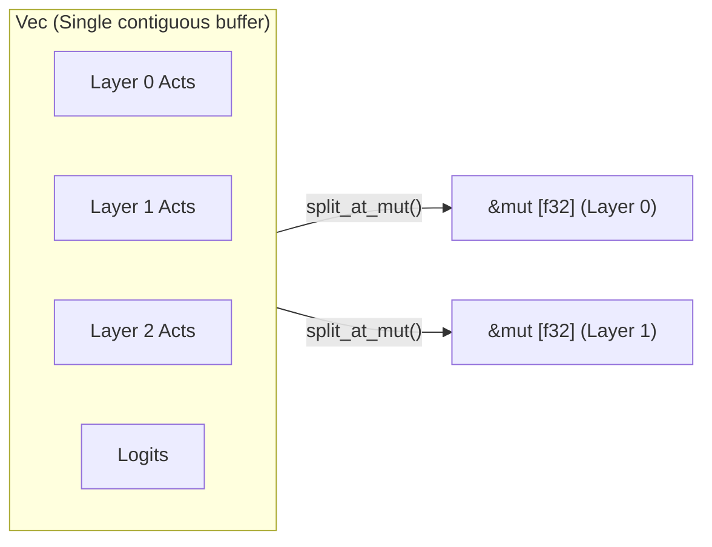

# Phase 3: Rust Architecture & Safe Flat-Buffer Memory Model

How can we reconcile the extreme throughput of `llm.c`'s flat buffer model with Rust's ownership and borrow checker guarantees?
This document defines the core Rust architecture and memory design of `oniwa-lm`.

---

## 1. The Flat Buffer Dilemma in Rust & The Disjoint Slice Solution

### 1.1 Why Naive Borrowing Fails the Borrow Checker
In C, one can freely cast raw pointers off a single allocation:

```c
// In C: freely reading and writing regardless of aliasing rules
float* out = memory + 0;
float* inp = memory + 1000;
matmul_forward(out, inp, ...);
```

In Rust, however, extracting multiple mutable slices (`&mut [f32]`) from the same `Vec<f32>` simultaneously, or holding an immutable slice (`&[f32]`) while mutating another, violates the fundamental *aliasing XOR mutability* rule.

### 1.2 Our Solution: Safe Arena & Disjoint Slices via `split_at_mut`

Rust's standard library provides a safe, zero-cost primitive specifically designed for this pattern: **`split_at_mut`**.



`split_at_mut` proves to the Rust compiler at compile time that the resulting slices are disjoint in memory. This enables zero-overhead flat-buffer performance with zero `unsafe` pointer dereferencing in layer logic.

---

## 2. Resource Budgeting for 16GB RAM Environments

Model parameter budgeting and memory footprint estimates ensuring smooth training without OS disk swapping on a 16GB RAM device:

### 2.1 Recommended Target Architecture (`oniwa-small` / Kitchen Garden Model)
* **Vocabulary Size ($V$)**: 8,192 – 16,384 (Japanese BPE / SentencePiece or Char-level)
* **Sequence Length ($T$)**: 512 – 1,024 tokens
* **Hidden Dimension ($C$)**: 512
* **Layer Count ($L$)**: 8
* **Query Heads ($H_Q$)**: 8 (head dimension $d = 64$)
* **KV Heads ($H_{KV}$)**: 2 ($G = 4$, Grouped-Query Attention)
* **FFN Intermediate Dimension ($d_{\text{ffn}}$)**: $512 \times \frac{8}{3} \approx 1365$ (SwiGLU golden ratio)

### 2.2 Memory Breakdown (Simulation)

| Memory Arena | Formulation | Size (B=4, T=512) |
| :--- | :--- | :--- |
| **Params (`f32`)** | Total parameter count $\approx 35\text{M}$ | **~140 MB** |
| **Gradients (`f32`)** | Identical size to parameters | **~140 MB** |
| **Optimizer (`AdamW`)** | First moment $m$ + second moment $v$ ($2 \times \text{Params}$) | **~280 MB** |
| **Activations (`f32`)** | All intermediate states ($L \times B \times T \times \dots$) | **~350 MB** |
| **Total Memory Required** | Full pretraining state | **~910 MB (< 1 GB!)** |

> [!TIP]
> **Headroom on 16GB RAM**  
> For models between 35M and 100M parameters, the entire training state fits neatly within **1 GB to 3 GB of RAM**.  
> On a 16GB machine (or Raspberry Pi 4 with 8GB RAM), training runs fully in physical memory with zero page swapping.

---

## 3. Module Hierarchy and Interface Design

Crate organization within `crates/oniwa-lm`:

```text
crates/oniwa-lm/
├── Cargo.toml
├── README.md
├── docs/
│   ├── 01_llm_c_architecture.md
│   ├── 02_modern_primitives.md
│   ├── 03_rust_memory_model.md
│   └── 04_development_handoff.md
└── src/
    ├── lib.rs
    ├── config.rs                   # Hyperparameters & buffer dimension calculations
    ├── thermal.rs                  # Hardware temperature monitoring & throttling
    ├── power.rs                    # Power / joules tracking
    ├── reproducibility.rs          # Checksums, PRNG determinism & ledger hooks
    ├── logger.rs                   # Provenance ledger indexing
    ├── layers/                     # Modern Primitives (Forward & Backward)
    │   ├── rmsnorm.rs
    │   ├── attention.rs
    │   └── mlp.rs
    ├── model.rs                    # Layer aggregation & full training loop
    └── tokenizer.rs                # Deterministic tokenization
```

### 3.1 Layer Interface Conventions
Layers do not retain dynamic computational graphs; they are defined as pure functions or stateless structs taking **input slices, parameter slices, and output slices**:

```rust
// Interface convention (e.g. RMSNorm)
pub struct RMSNorm;

impl RMSNorm {
    /// Forward pass: writes to `out` and `rstd_cache`
    pub fn forward(
        out: &mut [f32],        // [B, T, C]
        rstd_cache: &mut [f32], // [B, T] (reused in backward pass)
        inp: &[f32],            // [B, T, C]
        weight: &[f32],         // [C]
        eps: f32,
    ) {
        // ...
    }

    /// Backward pass: accumulates gradients into `dinp` and `dweight`
    pub fn backward(
        dinp: &mut [f32],       // [B, T, C]
        dweight: &mut [f32],    // [C]
        dout: &[f32],           // [B, T, C]
        inp: &[f32],            // [B, T, C]
        rstd_cache: &[f32],     // [B, T]
        weight: &[f32],         // [C]
    ) {
        // ...
    }
}
```

This design yields:
1. **Zero dynamic heap allocations** during inference and training passes.
2. **Effortless unit testing**: numerical gradient checks via finite differences can run directly on random buffer slices.
3. **Architectural portability**: backends can be swapped transparently between pure CPU, SIMD, and hardware acceleration.
