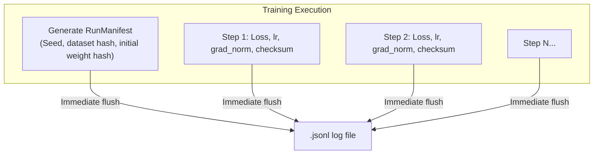

# Phase 3 Addendum: Full Logging, Deterministic Reproducibility & Low-Memory Build Guide

In the "Kitchen Garden & Clean AI (`oniwa-lm`)" philosophy, **Full Provenance Logging** and **Deterministic Reproducibility** form the core foundation upholding the integrity and trustworthiness of the project.

This document specifies the logging formats, determinism guarantees, and concrete mitigation steps to prevent out-of-memory (OOM) errors during compilation on memory-constrained devices like Raspberry Pi 4 (2GB–4GB RAM).

---

## 1. Low-Memory Compilation on Raspberry Pi 4

The Rust compiler (`rustc`) consumes significant memory during release builds (`--release`) due to compiler optimizations and link-time optimization (LTO). Attempting a naive `cargo build --release` on a Raspberry Pi 4 may trigger the Linux OOM Killer.

### Strategy 1: Limit Compilation Concurrency (Crucial)
By default, Cargo spawns parallel jobs equal to the number of CPU cores (4 on Raspberry Pi 4). Restricting parallel compilation jobs to `2` approximately halves peak memory consumption:

```bash
# Recommended build command on Raspberry Pi 4
cargo build --release -j 2
```

### Strategy 2: Cargo Profile Tuning
In the root `Cargo.toml`, avoid memory-intensive single codegen units (`codegen-units = 1`) and configure `codegen-units = 4`. This splits compilation into smaller chunks, dramatically lowering peak RAM usage.

### Strategy 3: Temporary Swap Allocation (Safety Net)
Default Raspberry Pi OS swap is small (~100MB). Configuring a temporary 1GB–2GB swap file prevents any sudden OOM crashes during linking:

```bash
# Set CONF_SWAPSIZE to 1024 or 2048 in /etc/dphys-swapfile, then restart swap:
sudo dphys-swapfile swapoff
sudo dphys-swapfile setup
sudo dphys-swapfile swapon
```

---

## 2. Full Provenance & Auditing Specifications

`oniwa-lm` records every causal event from training launch to conclusion in a single machine-readable `.jsonl` audit file.



### 2.1 Manifest Header (First Line)
The first line records an immutable snapshot of the execution environment:

```json
#MANIFEST:{"project_name":"oniwa-lm","version":"0.1.0","timestamp_utc":"2026-09-14T09:00:00Z","random_seed":42,"model_config":{"vocab_size":8192,"seq_len":256,"dim":256,"num_layers":4,"num_heads":4,"num_kv_heads":2,"ffn_dim":680},"dataset_sha256":"e3b0c44298...","initial_weights_sha256":"abcdef123...","platform_arch":"aarch64","os_name":"linux"}
```

This establishes irrefutable proof of **when, on what hardware, with which seed, and from what exact data the model originated**.

### 2.2 Immediate Flush per Step
Every `StepLog` is flushed (`flush()`) immediately to disk. Even if power to the Raspberry Pi is abruptly lost, all preceding iterations remain preserved and uncorrupted.

---

## 3. Deterministic Reproducibility

We guarantee that given identical random seeds and input data, anyone on any machine—from an x86 workstation to an ARM Raspberry Pi—will obtain bitwise identical weights and loss trajectories.

### 3.1 Platform-Independent PRNG (`DeterministicRng`)
Eliminating standard library or OS entropy sources, we use cryptographically sound `ChaCha8Rng`:
* Across x86_64 (Intel/AMD) and aarch64 (Raspberry Pi 4), **the exact same seed generates identical IEEE 754 floating-point sequences**.
* Gaussian initialization uses a stable Box-Muller transformation.

### 3.2 Floating-Point SHA-256 Checksums
Parameter arrays are serialized as little-endian raw bytes (`to_le_bytes()`) to compute canonical SHA-256 digests.
* Outputting and comparing checksums at initialization and periodic milestones (e.g. every 100 steps) mechanically verifies that zero numerical divergence has occurred.

### 3.3 Concurrency vs. Determinism Trade-offs
* Multi-threaded reductions (`rayon`) across matrix multiplications can introduce minor floating-point non-associativity (`~1e-7`).
* **Strict Determinism Mode**: For validation experiments requiring bitwise exact replication, running with `RAYON_NUM_THREADS=1` ensures 100% bitwise reproducibility.
