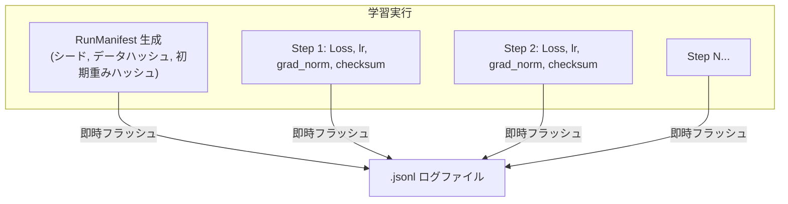

# Phase 3 追補: 完全ログ記録・決定論的再現性・ラズパイ低メモリビルド仕様

「家庭菜園・クリーンAI（`niwa-lm`）」構想において、**「全ログの保存（完全な出自追跡）」** と **「完璧な再現性（決定論的実行）」** は、プロジェクトの信頼性を担保する絶対的な基盤です。

また、Raspberry Pi 4 などのメモリ制約環境（2GB〜4GB RAM）でビルド時のメモリエラー（OOM）を回避するための具体的な対策についても規定します。

---

## 1. ラズパイ4でのビルド時メモリエラー対策（Low-Memory Build）

Rustコンパイラ（`rustc`）は、特にリリースビルド（`--release`）時に最適化とLTO（リンク時最適化）のために大量のメモリを消費します。ラズパイ4で何も対策せずに `cargo build --release` を実行すると、コンパイラプロセスがOSのOOM Killerによって強制終了されることがあります。

### 対策1: コンパイル並列度を制限する（最重要）
デフォルトではCPUコア数（ラズパイ4なら4）の並列ジョブが走り、メモリを食い合います。ジョブ数を `2` に制限することで、ビルド中のピークメモリ消費量を約半分に抑えられます。

```bash
# ラズパイ4での推奨ビルドコマンド
cargo build --release -j 2
```

### 対策2: `Cargo.toml` のプロファイルチューニング
ルートの `Cargo.toml` にて、メモリ消費の激しい `codegen-units = 1` を避け、`codegen-units = 4` に設定しています。これにより、コンパイラがメモリを小分けにして処理するため、OOMのリスクを劇的に下げられます。

### 対策3: スワップ領域の確保（保険）
ラズパイOSのデフォルトスワップは 100MB 程度と小さいため、万が一に備えて一時的に 1GB〜2GB のスワップを割り当てておくと絶対に落ちなくなります。

```bash
# /etc/dphys-swapfile の CONF_SWAPSIZE を 1024 または 2048 に変更して再起動
sudo dphys-swapfile swapoff
sudo dphys-swapfile setup
sudo dphys-swapfile swapon
```

---

## 2. 全ログ記録（Full Provenance & Auditing）の仕様

`niwa-lm` では、学習の開始から終了までの**すべての因果関係を1本の機械可読なログファイル（`.jsonl`）**として記録します。



### 2.1 マニフェストヘッダー（先頭行）
ログファイルの第1行目には、実行環境の完全なスナップショットが記録されます。
```json
#MANIFEST:{"project_name":"niwa-lm","version":"0.1.0","timestamp_utc":"2026-09-14T09:00:00Z","random_seed":42,"model_config":{"vocab_size":8192,"seq_len":256,"dim":256,"num_layers":4,"num_heads":4,"num_kv_heads":2,"ffn_dim":680},"dataset_sha256":"e3b0c44298...","initial_weights_sha256":"abcdef123...","platform_arch":"aarch64","os_name":"linux"}
```
これにより、**「いつ、どのハードウェアで、どのシードで、どのデータから生まれたモデルか」**が100%証明されます。

### 2.2 ステップごとの即時フラッシュ書き込み
各ステップのログ（`StepLog`）は、バッファリングを最小限にして即座にディスクにフラッシュ（`flush()`）されます。
たとえラズパイの電源が途中で抜けたとしても、直前ステップまでの全推移が破損せずにディスクに残ります。

---

## 3. 完璧な再現性（Deterministic Reproducibility）

「同じシード値とデータを与えれば、世界中の誰のPCでも、ラズパイでも、ビット単位で全く同一の重みとLossが得られる」状態を保証します。

### 3.1 プラットフォーム独立な決定論的乱数 (`DeterministicRng`)
標準ライブラリやOS依存の乱数を排し、暗号論的アルゴリズムに基づく `ChaCha8Rng` を採用しています。
* x86_64（Intel/AMD PC）でも ARM64（Raspberry Pi 4）でも、**全く同じシードからは100%同一の浮動小数点列**が生成されます。
* 正規分布の生成には、三角関数と対数に基づく安定した Box-Muller 変換を使用しています。

### 3.2 浮動小数点の SHA-256 チェックサム
各パラメータ配列は、リトルエンディアンの生バイト列（`to_le_bytes()`）として解釈され、SHA-256 ハッシュが計算されます。
* 初期化時、および指定ステップ（例: 100ステップごと）に重みチェックサムを出力・照合することで、計算環境による浮動小数点の誤差や乖離が発生していないかを機械的に検証できます。

### 3.3 並列計算と再現性のトレードオフ
* マルチスレッド（`rayon`）によるアテンションや行列積の並列化は、スレッド完了順序によって微小な丸め誤差（`1e-7` レベルの非決定性）を生む可能性があります。
* **厳密再現モード（Strict Determinism Mode）**:
  再現性の完全な証明を行う検証実験では、`RAYON_NUM_THREADS=1`（シングルスレッド）で実行することで、ビット完全一致（Bitwise Exactness）を達成できます。
