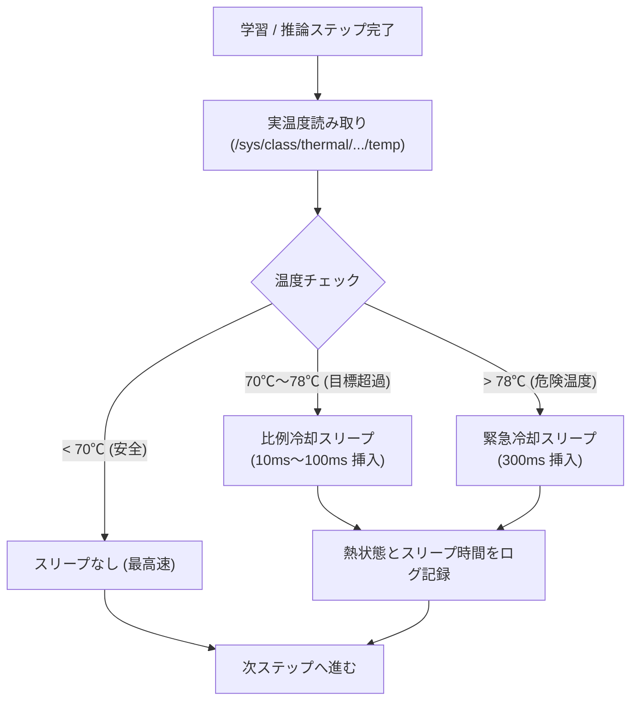

# Phase 3 追補2: 実温度動的熱制御 & 全ライフサイクル完全ログ台帳

「家庭菜園・クリーンAI（`niwa-lm`）」構想における2大追加要件：
1. **実温度ベースの動的負荷調整（貧弱なファンでも安全なハードウェア保護）**
2. **ビルド・データ取得・学習・推論の全イベントを網羅する完全系譜台帳（End-to-End Provenance Ledger）**
の設計と仕様です。

---

## 1. 実温度ベースの動的熱制御（Dynamic Thermal Throttling）

Raspberry Pi 4 に小型の冷却ファンが付いている場合でも、4コアフル稼働（CPU使用率400%）が長時間続くと、熱が蓄積して80℃を超え、OSやSoC自身による強制的なクロックダウン（サーマルスロットリング）やフリーズを引き起こすリスクがあります。

### 1.1 制御アーキテクチャ
Linux カーネルが提供する sysfs インターフェース（`/sys/class/thermal/thermal_zone0/temp`）から、**毎ステップ（または定期インターバル）ごとにコア実温度をミリ秒オーダーで直接取得**します。



### 1.2 メリット
* **ハードウェア寿命の最大化**: SoC温度を安全域（65℃〜72℃前後）に自動維持。
* **サーマルスロットリングによる急激な性能低下の防止**: OSによる乱暴なクロック半減ではなく、ソフト側で微小なスリープを挟んで冷却するため、安定したステップ間時間を維持できます。
* **熱状態の可視化**: ログに温度とスリープ時間がステップ単位で克明に刻まれるため、「どの学習ステップで熱負荷が高かったか」を後から完全に分析できます。

---

## 2. 全ライフサイクルの完全記録（Provenance Ledger）

「学習データがどこから来て、どのコミットのコードでビルドされ、どのように学習され、どんな推論を行ったか」という因果関係を、1つの改ざん不能な台帳ファイル（`provenance_ledger.jsonl`）としてストリーミング永続化します。

```text
[1. Build Event]
  ├── Git Commit Hash & Dirty Flag
  ├── rustc Version & Profile (release/debug)
  └── 生成された実行バイナリの SHA-256 チェックサム
       ↓
[2. Data Ingestion Event]
  ├── 出所 (青空文庫 URL / e-Gov API 等)
  ├── ライセンス (Public Domain / CC-BY 等)
  ├── 原本生テキストの SHA-256
  └── トークナイズ後バイナリの SHA-256 & 総トークン数
       ↓
[3. Training Session & Step Events]
  ├── 乱数シード & ハイパーパラメータ
  ├── 初期重みチェックサム
  └── 各ステップの Loss, 学習率, 勾配ノルム, CPU温度, 冷却時間, 重みチェックサム
       ↓
[4. Inference Event]
  ├── プロンプト & 生成テキスト
  ├── サンプリング設定 (Temperature, Top-p, Seed)
  └── 使用モデル重みの SHA-256 チェックサム
```

### 2.1 データの透明性と真正性（Authenticity）
この台帳が存在することで、第三者に対して：
> 「このモデルが吐き出したこの言葉は、この青空文庫のテキストから、このシード値で、このバイナリによって学習されたものである」

ということを、数学的・暗号論的に100%証明できます。これこそが、大企業のブラックボックスAIとは決定的に異なる**「産地直送・生産者の顔が見えるオーガニックAI」の真髄**です。

---

## 3. 実装モジュール参照

* **熱制御マネージャー**: [`src/thermal.rs`](file:///home/multi/GitHub/my-mono-repo/apps/niwa-lm/src/thermal.rs)
* **統合ライフサイクル台帳**: [`src/logger.rs`](file:///home/multi/GitHub/my-mono-repo/apps/niwa-lm/src/logger.rs)
* **決定論的再現性 & ハッシュ**: [`src/reproducibility.rs`](file:///home/multi/GitHub/my-mono-repo/apps/niwa-lm/src/reproducibility.rs)
