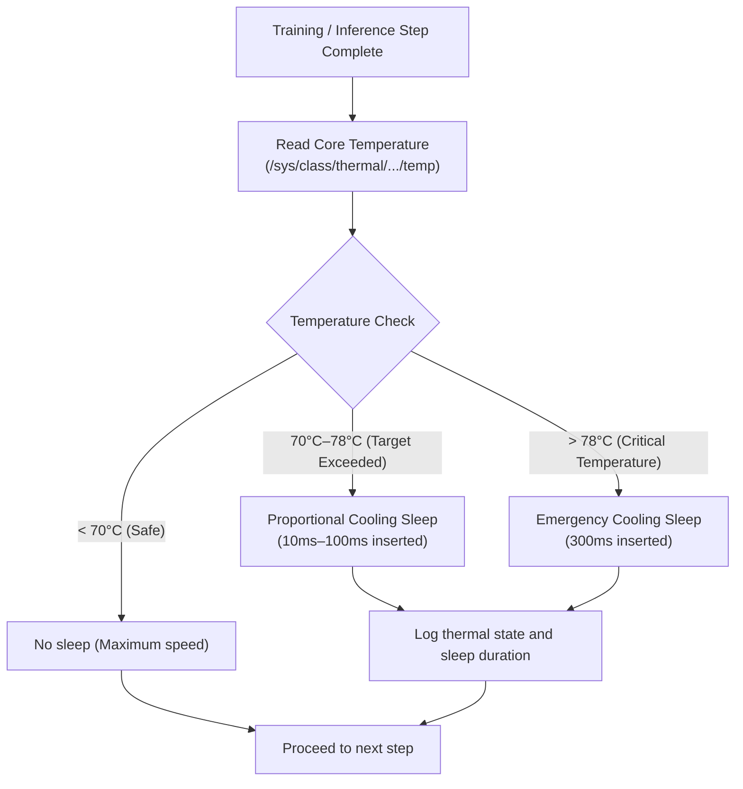

# Phase 3 Addendum 2: Real-Time Dynamic Thermal Throttling & End-to-End Provenance Ledger

<p align="left">
  <b>English</b> | <a href="06_thermal_and_end_to_end_provenance.ja.md">日本語 (Japanese)</a>
</p>


This document details two foundational capabilities of the "Kitchen Garden & Clean AI (`oniwa-lm`)" architecture:
1. **Dynamic thermal throttling based on physical CPU temperature (hardware protection for edge devices)**
2. **End-to-End Provenance Ledger covering build, data ingestion, training, and inference lifecycles**

---

## 1. Dynamic Thermal Throttling

Even when a Raspberry Pi 4 is equipped with a small cooling fan, sustained 100% load across all 4 CPU cores causes heat buildup that can exceed 80°C. This risks triggering OS/SoC hardware throttling or thermal lockups.

### 1.1 Control Architecture
Through the Linux kernel sysfs interface (`/sys/class/thermal/thermal_zone0/temp`), core temperatures are queried at millisecond precision on every step or at regular intervals.



### 1.2 Benefits
* **Hardware Longevity**: Automatically maintains SoC temperatures in a safe band (65°C–72°C).
* **Prevention of Abrupt Throttling**: Rather than abrupt OS-level frequency halving, smooth micro-sleeps maintain consistent inter-step throughput.
* **Full Thermal Auditability**: Every step records temperature and throttling duration into the ledger, providing complete post-hoc thermal analytics.

---

## 2. End-to-End Provenance Ledger

The entire causal sequence—where data originated, what exact commit built the binary, how training proceeded, and what inference outputs were generated—is streamed to an append-only, tamper-evident ledger (`ledger_index.jsonl`).

```text
[1. Build Event]
  ├── Git Commit Hash & Dirty Flag
  ├── rustc Version & Profile (release/debug)
  └── Generated Binary SHA-256 Checksum
       ↓
[2. Data Ingestion Event]
  ├── Provenance Source (Aozora Bunko URL / e-Gov API / arXiv / etc.)
  ├── License (Public Domain / CC-BY / etc.)
  ├── Raw Raw Text SHA-256 Digest
  └── Tokenized Binary SHA-256 & Total Token Count
       ↓
[3. Training Session & Step Events]
  ├── Random Seed & Hyperparameters
  ├── Initial Weights Checksum
  └── Step Loss, Learning Rate, Gradient Norm, CPU Temp, Sleep Time, Weight Checksum
       ↓
[4. Inference Event]
  ├── Prompt & Generated Text
  ├── Sampling Configuration (Temperature, Top-p, Seed)
  └── Active Weights SHA-256 Checksum
```

### 2.1 Transparency and Authenticity
With this ledger, one can cryptographically and mathematically demonstrate to any auditor:
> "This sentence generated by this model was cultivated from this specific public domain text, with this random seed, executed by this exact binary."

This is the very essence of **"organic intelligence with full provenance"**, in direct contrast to Big Tech black-box systems.

---

## 3. Implementation Module References

* **Thermal Manager**: [`crates/oniwa-lm/src/thermal.rs`](../crates/oniwa-lm/src/thermal.rs)
* **Unified Lifecycle Ledger**: [`crates/oniwa-lm/src/logger.rs`](../crates/oniwa-lm/src/logger.rs)
* **Deterministic Reproducibility & Checksums**: [`crates/oniwa-lm/src/reproducibility.rs`](../crates/oniwa-lm/src/reproducibility.rs)
