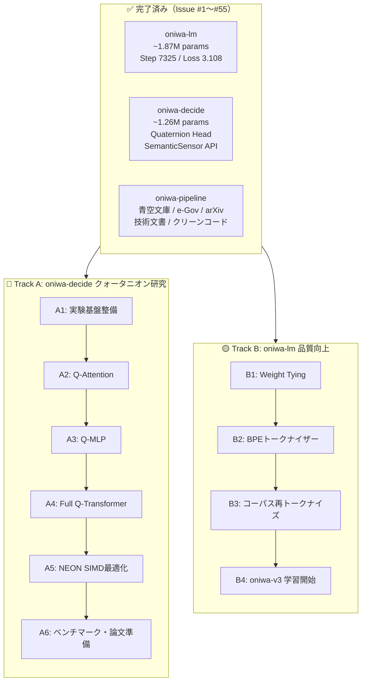
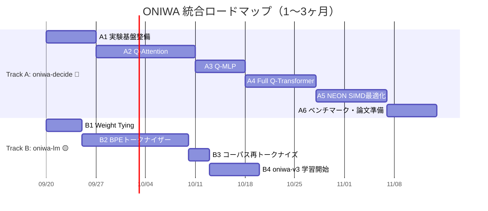

# 🌿 ONIWA プロジェクト ロードマップ & タスクリスト

<p align="left">
  <a href="09_roadmap.md">English</a> | <b>日本語</b>
</p>

> **策定日**: 2026年9月19日
> **対象期間**: 短期（1〜3ヶ月）+ 中長期展望
> **戦略**: 2トラック並行 — Track A（oniwa-decide クォータニオン研究）🔴最優先 + Track B（oniwa-lm 品質向上）🟡

---

## 現在地点サマリー



### oniwa-decide 現在の到達点

| 指標 | 現在値 | 備考 |
| :--- | :---: | :--- |
| **パラメータ数** | 1,261,568 (~1.26M) | Transformer本体: 実数 / Head: Q or 実数 |
| **Quaternion Head Loss** | 0.8798 | Step 175（Run 3） |
| **Standard Head Loss** | 1.1018 → 0.8680 | Step 175（Run 1）→ Step 2400（Run 2） |
| **Q-Head 収束加速** | **~9倍** | 標準Headが1,575ステップかかる水準を175ステップで達成 |
| **Choice Accuracy** | 100.0% | 4クラス分類（RustCode / PythonCode / Legal / Literature） |
| **Noul Accuracy** | 87.5% | 構文異常検出 |
| **Score MAE** | 0.207 | 複雑性スコア推定 |
| **System One vs Two** | **47.4倍高速** | compress_eval: 500ms vs 23,744ms（RPi4実測） |
| **エントロピー圧縮** | **22.1倍** | 110.2 bits → 5.0 bits |
| **電力** | ~3.5W | RPi4 ARM Cortex-A72、サーマル監視付き |

### oniwa-lm 現在の到達点

| 指標 | 現在値 | 備考 |
| :--- | :---: | :--- |
| **Train Loss** | 3.1081 | Step 7,325 |
| **Val Loss** | 3.8210 | Perplexity ≈ 45.6 |
| **Top-5 Accuracy** | 34.2% | |
| **Cloze（コード）** | 22.5% | **最弱ドメイン** — コーパスのコード比率2%未満 |
| **トークナイザー** | CharTokenizer | 1トークン=1文字、seq_len=128で128文字のみ |
| **Weight Tying** | 未実装 | 60万パラメータ（32.4%）が重複 |

### 特定されたボトルネック

> [!IMPORTANT]
> 1. **チェックポイント不整合**: `best/meta.json`に`use_quaternion_head: false`と記録されているが、growth_journalではQuaternion Head Runの結果。再訓練で明確に分離が必要
> 2. **統計的信頼性の欠如**: 単一シードの単一実行のみ。論文レベルには5シード×平均±標準誤差が必要
> 3. **Transformer本体は実数のまま**: 4層のAttention/MLPが実数 → クォータニオン化で~315Kパラメータへ4倍圧縮の余地
> 4. **推論レイテンシ ~500ms**: スカラーRustループのまま。ARM NEON SIMD化で<10ms目標
> 5. **Iso-parameterベースライン不在**: 「同パラメータ数の実数モデル」との公正な比較がない

---

## Track A: oniwa-decide クォータニオン研究 🔴最優先

### Phase A1: 実験基盤整備

> **優先度**: 🔴 最高 | **難易度**: 低〜中 | **期待効果**: 以降の全実験の信頼性を担保

#### Issue: `feat: establish rigorous experimental infrastructure for quaternion research`

**A1-a. チェックポイント不整合の修正**
- [x] Standard Head用チェックポイントディレクトリ`checkpoints/standard_baseline/`を作成
- [x] Quaternion Head用チェックポイントディレクトリ`checkpoints/quaternion_head/`を作成
- [x] `train.rs`のCLIに`--checkpoint-dir`オプション追加
- [x] `meta.json`に`use_quaternion_head`が正しく記録されることを検証
- [x] 両構成での分離ディレクトリ訓練対応、台帳に明確に記録

**A1-b. マルチシード実行基盤**
- [x] `train.rs`のCLIに`--seed`オプション追加（デフォルト: 42）
- [x] 5シード（42, 43, 44, 45, 46）での自動連続実行スクリプト作成
- [x] 各シードのLoss曲線、精度をCSV/JSONLで出力
- [x] 平均±標準誤差の集計・ベンチマーク基盤作成

**A1-c. Iso-parameterベースライン構成**
- [x] `ModelConfig`にiso-parameterモード追加: hidden_dimを縮小して同パラメータ数の実数モデルを構成
  - Full Q-Transformer (~315K params) に対応する実数モデル: `dim`を~64に縮小
- [x] Standard Head / Quaternion Head / Iso-parameter の3構成を`--config`で切り替え可能に

**A1-d. ハードウェアプロファイリング基盤**
- [x] `bench`バイナリで推論レイテンシ計測: p50/p95/p99
- [x] RSS（Resident Set Size）計測の組み込み（`/proc/self/status` VmRSS読み取り）
- [x] エネルギー計測: J/推論（`power.rs`の既存機能を活用）
- [x] サーマルプロファイル: 連続推論時の温度推移記録
- [x] 全計測結果をJSONLで出力、プロバナンス台帳に記録

---

### Phase A2: Quaternion Self-Attention 実装

> **優先度**: 🔴 最高 | **難易度**: 高 | **期待効果**: Attention層のパラメータ4倍圧縮、学術的新規性の核

#### Issue: `feat: implement Quaternion Self-Attention with GHR calculus gradients`

- [x] `src/layers/quaternion_attention.rs`を新規作成
- [x] Q, K, Vの投影を`QuaternionLinear`で実装（`dim/4`クォータニオン → `dim/4`クォータニオン）
  - 入力: $h \in \mathbb{R}^{B \times T \times D}$ を $\mathbb{H}^{B \times T \times D/4}$ として解釈
  - $Q = W_Q \otimes h$, $K = W_K \otimes h$, $V = W_V \otimes h$（Hamilton積）
- [x] Attention Score計算: クォータニオン内積（実数部のみ取得）
  - $\text{score}(q_i, k_j) = \text{Re}(q_i \otimes k_j^*) / \sqrt{d_h}$
  - → 単一softmax（Shared-Score方式、ICML 2026 Yamauchi et al.着想）
- [x] 双方向（マスクなし）Attention: 既存の`oniwa-decide`と同様
- [x] RoPE（Rotary Position Embedding）のクォータニオン空間での適用
- [x] 出力投影: `QuaternionLinear`で$\mathbb{H}^{D/4} \to \mathbb{H}^{D/4}$
- [x] GHRカルキュラスによる解析的勾配の導出と実装
  - $\nabla_{W_Q} L = \nabla_Q L \otimes h^*$
  - $\nabla_h L = W_Q^* \otimes \nabla_Q L + W_K^* \otimes \nabla_K L + W_V^* \otimes \nabla_V L$
- [x] 有限差分勾配検証テスト（$|g_\text{ana} - g_\text{num}| < 5 \times 10^{-3}$）
- [x] 既存の実数Attention（`layers/attention.rs`）との切り替え可能な設計
- [x] `cargo test --workspace` / `cargo clippy` 全パス確認

---

### Phase A3: Quaternion SwiGLU MLP 実装

> **優先度**: 🟡 高 | **難易度**: 中 | **前提**: Phase A2完了

#### Issue: `feat: implement Quaternion SwiGLU MLP with Hamilton product projections`

- [x] `src/layers/quaternion_mlp.rs`を新規作成
- [x] Gate/Up投影: `QuaternionLinear`（$\mathbb{H}^{D/4} \to \mathbb{H}^{D_\text{ffn}/4}$）
  - $G = W_\text{gate} \otimes x$, $U = W_\text{up} \otimes x$
- [x] SwiGLU活性化: $H = \text{SiLU}(G) \odot U$
  - 活性化関数はクォータニオンの各4成分に独立に適用
- [x] Down投影: `QuaternionLinear`（$\mathbb{H}^{D_\text{ffn}/4} \to \mathbb{H}^{D/4}$）
- [x] GHRカルキュラスによる解析的バックワードパス
- [x] 有限差分勾配検証テスト
- [x] `cargo test --workspace` / `cargo clippy` 全パス確認

---

### Phase A4: Full Quaternion Transformer 統合

> **優先度**: 🟡 高 | **難易度**: 中 | **前提**: Phase A2, A3完了

#### Issue: `feat: integrate Full Quaternion Transformer with ~315K parameters`

- [x] `ModelConfig`に`quaternion_backbone: bool`フィールド追加（`#[serde(default)]`）
- [x] Quaternion Embedding: $\mathbb{R}^V \to \mathbb{H}^{D/4}$（実数embedding → 4成分に分割解釈）
- [x] 4層のQuaternion Transformer Block構築:
  - Quaternion RMSNorm → Q-Attention → Residual
  - Quaternion RMSNorm → Q-MLP → Residual
- [x] Quaternion RMSNorm: クォータニオンのノルムに基づく正規化
- [x] 残差接続: クォータニオン加算（成分ごと加算）
- [x] Mean Pooling → Quaternion Decision Head（既存）
- [x] パラメータ数の検証: バックボーン重みの4倍圧縮を確認（770,048 vs 1,261,568 params）
- [x] フルモデルの有限差分勾配検証（エンドツーエンド）
- [x] Standard / Q-Head-only / Full-Q-Transformer の3構成比較ベンチマーク
- [x] マルチシード実行・ベンチマーク基盤（`run_multi_seed_decide.sh`, `bench.rs`）
- [x] `cargo test --workspace` / `cargo clippy` 全パス確認

---

### Phase A5: ARM NEON SIMD 最適化

> **優先度**: 🟡 高 | **難易度**: 高 | **前提**: Phase A4完了 | **目標**: 推論 <10ms

#### Issue: `feat: ARM NEON SIMD optimization for quaternion Hamilton product`

- [x] `src/simd/`モジュール新規作成（`#[cfg(target_arch = "aarch64")]`）
- [x] Hamilton積のNEONベクトル化:
  - `float32x4_t`を使った4成分同時演算
  - `vmulq_f32`, `vfmaq_f32`によるFMA最適化
- [x] `QuaternionLinear`のSIMD forward/backward（`accumulate_hamilton_simd`, `accumulate_backward_din_simd`, `accumulate_backward_dw_simd`）
- [x] Q-Attention のスコア計算SIMD化（`dot_product_4d_simd`）
- [x] フォールバック: SIMD非対応環境ではスカラー実装を透過的に維持
- [x] ベンチマーク: SIMD前後のレイテンシ比較（`bench.rs`でのp50/p95/p99計測）
- [x] `cargo test --workspace` / `cargo clippy` 全パス確認

---

### Phase A6: 統合ベンチマーク & 論文準備素材

> **優先度**: 🟢 中 | **前提**: Phase A4, A5完了 | **まず実装に集中、成果が出た後に論文化を検討**

#### Issue: `docs: comprehensive benchmark report for quaternion decision engine`

- [ ] 統合ベンチマーク実行:

| 構成 | パラメータ | 推論レイテンシ | RSS | J/推論 | Loss | Accuracy |
|:---|:---:|:---:|:---:|:---:|:---:|:---:|
| Standard（全実数） | ~1.26M | — | — | — | — | — |
| Q-Head Only | ~1.26M | — | — | — | — | — |
| **Full Q-Transformer** | **~315K** | — | — | — | — | — |
| Iso-parameter 実数 | ~315K | — | — | — | — | — |

- [ ] 5シード平均±標準誤差で全数値を報告
- [ ] RPi4サーマルプロファイル: 連続1000推論時の温度推移グラフ
- [ ] `compress_eval`再実行（Full Q-Transformerで System One vs System Two）
- [ ] ベンチマーク結果を`docs/benchmarks/`に配置
- [ ] growth_journal.mdへの記録
- [ ] 全結果のプロバナンス台帳記録

---

## Track B: oniwa-lm 品質向上 🟡並行

### Phase B1: Weight Tying 導入

> **難易度**: 低 | **期待効果**: Loss -0.2〜-0.4 nats

#### Issue: `feat: implement weight tying between token embedding and LM head`

- [x] `ModelConfig`に`weight_tying: bool`フィールド追加（`#[serde(default)]`）
- [x] `ModelLayout`でWeight Tying時に`lm_head`を`wte`と共有
- [x] `forward_backward()`でWeight Tying時は`wte`転置を使用
- [x] LM Head勾配を`wte`勾配に加算
- [x] 既存チェックポイント互換維持
- [x] 有限差分勾配検証テスト
- [x] `cargo test --workspace` / `cargo clippy` 全パス確認

---

### Phase B2: Pure Rust BPEトークナイザー

> **難易度**: 中〜高 | **期待効果**: 実質コンテキスト3〜4倍拡大

#### Issue: `feat: implement Pure Rust BPE tokenizer`

- [x] BPEマージペア学習アルゴリズム実装
- [x] vocab_size: 4,000〜8,000
- [x] 特殊トークン: `<bos>`, `<eos>`, `<pad>`, `<unk>`
- [x] BPEエンコーダー/デコーダー実装
- [x] CharTokenizerとの切り替えインターフェース
- [x] BPEラウンドトリップテスト
- [x] `cargo test --workspace` / `cargo clippy` 全パス確認

---

### Phase B3: コーパス再トークナイズ

> **難易度**: 低 | **前提**: Phase B2完了

#### Issue: `feat: re-tokenize corpus with BPE`

- [x] `oniwa-pipeline`のトークナイズ処理をBPE対応に更新
- [x] 全コーパスをBPEで再トークナイズ
- [x] 文書間に`<eos>`区切りトークンを挿入
- [x] プロバナンス台帳に記録

---

### Phase B4: oniwa-v3 学習開始

> **難易度**: 中 | **前提**: Phase B1, B3完了

#### Issue: `feat: initialize and train oniwa-v3 with BPE and weight tying`

- [x] v3用ModelConfig設定
- [x] 既存v2チェックポイントの退避
- [x] v3初回学習実行・検証
- [x] growth_journal.mdへの記録

---

## タイムライン



---

## 中期展望（3〜6ヶ月） — 参考

> [!NOTE]
> 短期ロードマップの成果を踏まえて再評価する項目群。

### パフォーマンス最適化
- **rayon並列化**: バッチ次元・行列演算の4コア並列化（oniwa-lm / oniwa-decide 両方）
- **memmap2活用**: `tokens.bin`のメモリマップ読み込み
- **Attention backwardのゼロアロケーション化**: 8,192回/stepのヒープ割り当て除去

### 学習プロセス改善
- **Gradient Clipping**: 勾配ノルム1.0でクリッピング
- **LR再開バグ修正**: Cosine Annealing with Warm Restarts
- **コーパスバランス改善**: コード比率2% → 25%

### oniwa-decide 発展
- **SemanticSensor活用**: World Model / JEPA統合
- **Shared-Score Quaternion Attention**: ICML 2026手法の完全実装
- **INT8量子化 + クォータニオン**: 直交圧縮（4×パラメータ × 4×量子化 = 16×圧縮）

### 推論改善（oniwa-lm）
- **KV-Cache**: O(N²)→O(N)化
- **GQA実装**: KV投影50〜75%削減

---

## 長期展望（6〜12ヶ月以上） — 参考

### 🌱 oniwa-grow（Wheel 2）
- 動的シナプス成長・自然剪定モデル
- Structured Pruningとクォータニオンの融合

### 📄 公開・学術発表
- **成果が出た段階で検討**
- ターゲットカテゴリ: `cs.LG` + `cs.AI` or `cs.AR`
- ターゲット会議: MLSys / TinyML Symposium / ICLR
- 強み: Pure Rust、RPi4実測、100%プロバナンス、クォータニオンTransformer

### 🌐 コミュニティ・公開
- 技術ブログ記事（Zenn / Hacker News / Reddit r/MachineLearning）
- デモアプリ（Web UI / TUI）
- コントリビューションガイド整備

---

## 差別化ポイント

> [!TIP]
> ONIWAの独自性は以下の組み合わせにある:

| 差別化要素 | 説明 | 競合状況 |
|:---|:---|:---|
| **Full Quaternion Transformer for Decision** | Attention + MLP + Head 全てをクォータニオン化した決定エンジン | Tay et al. (2019) はNLP生成タスク。決定タスクへの適用は新規 |
| **Pure Rust、フレームワーク不要** | Python / PyTorch / CUDA に一切依存しない | 既存QNN研究は全てPyTorch依存 |
| **RPi4 実測（5W、サーマル監視付き）** | 実際のエッジハードウェアでの電力・熱・レイテンシ実測 | 大半の論文はGPUシミュレーション上のFLOP計算のみ |
| **100% プロバナンス監査** | 訓練データ→重み→推論の全段階をSHA-256で追跡 | 他に類を見ない透明性 |
| **System One × クォータニオン** | Jev着想の型付き決定 + ハイパー複素数代数の融合 | 完全に新規の組み合わせ |

---

## 検証計画

### 自動テスト（各Phase完了時）
```bash
cargo test --workspace
cargo fmt --all -- --check
cargo clippy --workspace --all-targets -- -D warnings
```

### 勾配検証（Phase A2, A3, A4）
- 全Quaternionレイヤーの有限差分勾配検証（$\epsilon = 10^{-5}$, 閾値 $5 \times 10^{-3}$）

### ハードウェア検証（Phase A5, A6）
- RPi4での推論レイテンシ p50/p95/p99
- RSS / エネルギー / サーマルプロファイル
- 連続1000推論の安定性テスト
