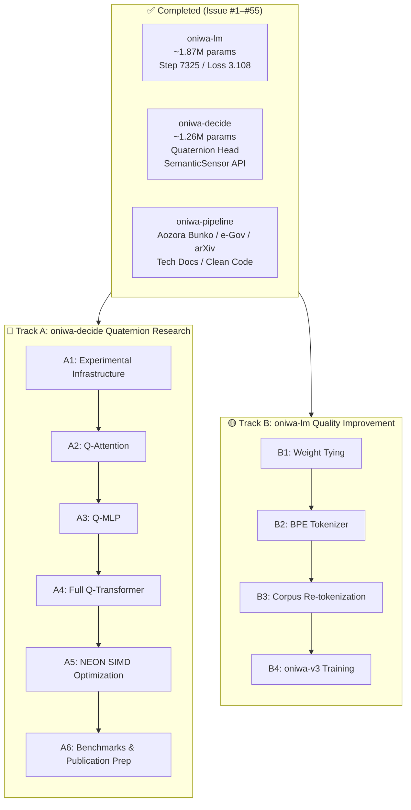
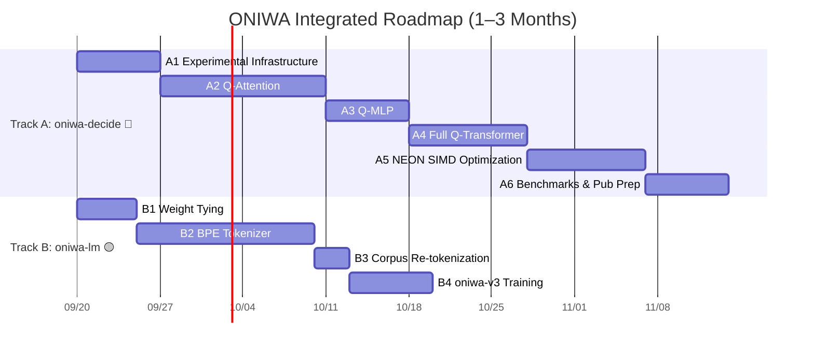

# 🌿 ONIWA Project Roadmap & Task List

<p align="left">
  <b>English</b> | <a href="09_roadmap.ja.md">日本語 (Japanese)</a>
</p>

> **Created**: September 19, 2026
> **Scope**: Short-term (1–3 months) + Mid/Long-term Outlook
> **Strategy**: Dual-track parallel — Track A (oniwa-decide Quaternion Research) 🔴 Top Priority + Track B (oniwa-lm Quality Improvement) 🟡

---

## Current State Summary



### oniwa-decide: Current Metrics

| Metric | Value | Notes |
| :--- | :---: | :--- |
| **Parameters** | 1,261,568 (~1.26M) | Transformer backbone: real-valued / Head: Q or real |
| **Quaternion Head Loss** | 0.8798 | Step 175 (Run 3) |
| **Standard Head Loss** | 1.1018 → 0.8680 | Step 175 (Run 1) → Step 2400 (Run 2) |
| **Q-Head Convergence Speedup** | **~9×** | Reaches the standard head's 1,575-step loss level in just 175 steps |
| **Choice Accuracy** | 100.0% | 4-class classification (RustCode / PythonCode / Legal / Literature) |
| **Noul Accuracy** | 87.5% | Syntax anomaly detection |
| **Score MAE** | 0.207 | Complexity score estimation |
| **System One vs Two** | **47.4× faster** | compress_eval: 500ms vs 23,744ms (RPi4 measured) |
| **Entropy Compression** | **22.1×** | 110.2 bits → 5.0 bits |
| **Power** | ~3.5W | RPi4 ARM Cortex-A72, thermal monitoring enabled |

### oniwa-lm: Current Metrics

| Metric | Value | Notes |
| :--- | :---: | :--- |
| **Train Loss** | 3.1081 | Step 7,325 |
| **Val Loss** | 3.8210 | Perplexity ≈ 45.6 |
| **Top-5 Accuracy** | 34.2% | |
| **Cloze (Code)** | 22.5% | **Weakest domain** — code corpus < 2% |
| **Tokenizer** | CharTokenizer | 1 token = 1 char, only 128 chars at seq_len=128 |
| **Weight Tying** | Not implemented | 604K params (32.4%) duplicated |

### Identified Bottlenecks

> [!IMPORTANT]
> 1. **Checkpoint metadata inconsistency**: `best/meta.json` records `use_quaternion_head: false` despite being from the Quaternion Head training run. Needs re-training with proper separation.
> 2. **No statistical confidence**: Single seed, single run only. Publication-grade results require 5 seeds with mean ± standard error.
> 3. **Transformer backbone is real-valued**: 4-layer Attention/MLP remain real → quaternionization could compress to ~315K params (4× reduction).
> 4. **Inference latency ~500ms**: Scalar Rust loops only. ARM NEON SIMD optimization targets <10ms.
> 5. **No iso-parameter baseline**: Missing fair comparison against a real-valued model with the same parameter count.

---

## Track A: oniwa-decide Quaternion Research 🔴 Top Priority

### Phase A1: Experimental Infrastructure

> **Priority**: 🔴 Highest | **Difficulty**: Low–Medium | **Impact**: Ensures reliability of all subsequent experiments

#### Issue: `feat: establish rigorous experimental infrastructure for quaternion research`

**A1-a. Checkpoint Inconsistency Fix**
- [x] Create dedicated checkpoint directory `checkpoints/standard_baseline/`
- [x] Create dedicated checkpoint directory `checkpoints/quaternion_head/`
- [x] Add `--checkpoint-dir` CLI option to `train.rs`
- [x] Verify `meta.json` correctly records `use_quaternion_head`
- [x] Support separated training runs and audit ledger recording

**A1-b. Multi-Seed Execution Infrastructure**
- [x] Add `--seed` CLI option to `train.rs` (default: 42)
- [x] Create automated sequential execution script for 5 seeds (42–46)
- [x] Output per-seed loss curves and accuracies as CSV/JSONL
- [x] Create aggregation & benchmark infrastructure

**A1-c. Iso-Parameter Baseline Configuration**
- [x] Add iso-parameter mode to `ModelConfig`: shrink hidden_dim to match parameter count of Full Q-Transformer (~315K params → `dim` ≈ 64)
- [x] Enable switching between Standard / Q-Head-only / Iso-parameter via `--config` flag

**A1-d. Hardware Profiling Infrastructure**
- [x] Extend `bench` binary for inference latency measurement: p50/p95/p99
- [x] Integrate RSS (Resident Set Size) measurement (`/proc/self/status` VmRSS)
- [x] Energy measurement: J/inference (leverage existing `power.rs`)
- [x] Thermal profiling: temperature trajectory during sustained inference
- [x] Output all measurements as JSONL, record in provenance ledger

---

### Phase A2: Quaternion Self-Attention

> **Priority**: 🔴 Highest | **Difficulty**: High | **Impact**: 4× parameter compression of attention layers; core academic novelty

#### Issue: `feat: implement Quaternion Self-Attention with GHR calculus gradients`

- [x] Create `src/layers/quaternion_attention.rs`
- [x] Implement Q, K, V projections via `QuaternionLinear` (`dim/4` quaternions → `dim/4` quaternions)
  - Input: interpret $h \in \mathbb{R}^{B \times T \times D}$ as $\mathbb{H}^{B \times T \times D/4}$
  - $Q = W_Q \otimes h$, $K = W_K \otimes h$, $V = W_V \otimes h$ (Hamilton product)
- [x] Attention score computation: quaternion inner product (extract real part only)
  - $\text{score}(q_i, k_j) = \text{Re}(q_i \otimes k_j^*) / \sqrt{d_h}$
  - → Single softmax (Shared-Score approach, inspired by Yamauchi et al. ICML 2026)
- [x] Bidirectional (unmasked) attention: consistent with existing `oniwa-decide`
- [x] RoPE (Rotary Position Embedding) adaptation for quaternion space
- [x] Output projection: `QuaternionLinear` ($\mathbb{H}^{D/4} \to \mathbb{H}^{D/4}$)
- [x] Derive and implement analytical gradients via GHR calculus
  - $\nabla_{W_Q} L = \nabla_Q L \otimes h^*$
  - $\nabla_h L = W_Q^* \otimes \nabla_Q L + W_K^* \otimes \nabla_K L + W_V^* \otimes \nabla_V L$
- [x] Finite-difference gradient verification test ($|g_\text{ana} - g_\text{num}| < 5 \times 10^{-3}$)
- [x] Switchable design between real-valued Attention (`layers/attention.rs`) and Q-Attention
- [x] `cargo test --workspace` / `cargo clippy` all green

---

### Phase A3: Quaternion SwiGLU MLP

> **Priority**: 🟡 High | **Difficulty**: Medium | **Prerequisite**: Phase A2 complete

#### Issue: `feat: implement Quaternion SwiGLU MLP with Hamilton product projections`

- [x] Create `src/layers/quaternion_mlp.rs`
- [x] Gate/Up projections: `QuaternionLinear` ($\mathbb{H}^{D/4} \to \mathbb{H}^{D_\text{ffn}/4}$)
  - $G = W_\text{gate} \otimes x$, $U = W_\text{up} \otimes x$
- [x] SwiGLU activation: $H = \text{SiLU}(G) \odot U$
  - Apply activation independently to each of the 4 quaternion components
- [x] Down projection: `QuaternionLinear` ($\mathbb{H}^{D_\text{ffn}/4} \to \mathbb{H}^{D/4}$)
- [x] Analytical backward pass via GHR calculus
- [x] Finite-difference gradient verification test
- [x] `cargo test --workspace` / `cargo clippy` all green

---

### Phase A4: Full Quaternion Transformer Integration

> **Priority**: 🟡 High | **Difficulty**: Medium | **Prerequisite**: Phase A2, A3 complete

#### Issue: `feat: integrate Full Quaternion Transformer with ~315K parameters`

- [x] Add `quaternion_backbone: bool` field to `ModelConfig` (`#[serde(default)]`)
- [x] Quaternion Embedding: $\mathbb{R}^V \to \mathbb{H}^{D/4}$ (interpret real embedding as 4-component quaternions)
- [x] Build 4-layer Quaternion Transformer Blocks:
  - Quaternion RMSNorm → Q-Attention → Residual
  - Quaternion RMSNorm → Q-MLP → Residual
- [x] Quaternion RMSNorm: normalization based on quaternion norm
- [x] Residual connections: quaternion addition (component-wise)
- [x] Mean Pooling → Quaternion Decision Head (existing)
- [x] Verify parameter count: confirm 4x compressed backbone weights (770,048 vs 1,261,568)
- [x] End-to-end finite-difference gradient verification
- [x] 3-configuration comparison benchmark: Standard / Q-Head-only / Full-Q-Transformer
- [x] Multi-seed execution and benchmark infrastructure (`run_multi_seed_decide.sh`, `bench.rs`)
- [x] `cargo test --workspace` / `cargo clippy` all green

---

### Phase A5: ARM NEON SIMD Optimization

> **Priority**: 🟡 High | **Difficulty**: High | **Prerequisite**: Phase A4 complete | **Target**: Inference <10ms

#### Issue: `feat: ARM NEON SIMD optimization for quaternion Hamilton product`

- [x] Create `src/simd/` module (`#[cfg(target_arch = "aarch64")]`)
- [x] Vectorize Hamilton product with NEON:
  - Simultaneous 4-component computation via `float32x4_t`
  - FMA optimization with `vmulq_f32`, `vfmaq_f32`
- [x] SIMD-accelerated `QuaternionLinear` forward/backward (`accumulate_hamilton_simd`, `accumulate_backward_din_simd`, `accumulate_backward_dw_simd`)
- [x] SIMD-accelerated Q-Attention score computation (`dot_product_4d_simd`)
- [x] Scalar fallback for non-SIMD / non-aarch64 environments
- [x] Benchmark: pre/post SIMD latency comparison in `bench.rs` (p50/p95/p99)
- [x] `cargo test --workspace` / `cargo clippy` all green

---

### Phase A6: Comprehensive Benchmarks & Publication Material

> **Priority**: 🟢 Medium | **Prerequisite**: Phase A4, A5 complete | **Focus on implementation first; consider publication after results**

#### Issue: `docs: comprehensive benchmark report for quaternion decision engine`

- [ ] Run comprehensive benchmarks:

| Configuration | Parameters | Inference Latency | RSS | J/inference | Loss | Accuracy |
|:---|:---:|:---:|:---:|:---:|:---:|:---:|
| Standard (Full Real) | ~1.26M | — | — | — | — | — |
| Q-Head Only | ~1.26M | — | — | — | — | — |
| **Full Q-Transformer** | **~315K** | — | — | — | — | — |
| Iso-parameter Real | ~315K | — | — | — | — | — |

- [ ] Report all figures as 5-seed mean ± standard error
- [ ] RPi4 thermal profile: temperature trajectory graph during 1000 consecutive inferences
- [ ] Re-run `compress_eval` (System One vs System Two) with Full Q-Transformer
- [ ] Place benchmark results in `docs/benchmarks/`
- [ ] Record in growth_journal.md
- [ ] Record all results in provenance ledger

---

## Track B: oniwa-lm Quality Improvement 🟡 Parallel

### Phase B1: Weight Tying

> **Difficulty**: Low | **Expected Impact**: Loss reduction of -0.2 to -0.4 nats

#### Issue: `feat: implement weight tying between token embedding and LM head`

- [x] Add `weight_tying: bool` field to `ModelConfig` (`#[serde(default)]`)
- [x] Share `lm_head` offset with `wte` in `ModelLayout` when Weight Tying is enabled
- [x] Use transposed `wte` in `forward_backward()` when Weight Tying is enabled
- [x] Accumulate LM Head gradients into `wte` gradients
- [x] Maintain backward compatibility with existing checkpoints
- [x] Finite-difference gradient verification test
- [x] `cargo test --workspace` / `cargo clippy` all green

---

### Phase B2: Pure Rust BPE Tokenizer

> **Difficulty**: Medium–High | **Expected Impact**: 3–4× effective context expansion

#### Issue: `feat: implement Pure Rust BPE tokenizer`

- [ ] Implement BPE merge-pair learning algorithm
- [ ] Target vocab_size: 4,000–8,000
- [ ] Special tokens: `<bos>`, `<eos>`, `<pad>`, `<unk>`
- [ ] Implement BPE encoder/decoder
- [ ] Switching interface between CharTokenizer and BpeTokenizer
- [ ] BPE round-trip tests
- [ ] `cargo test --workspace` / `cargo clippy` all green

---

### Phase B3: Corpus Re-tokenization

> **Difficulty**: Low | **Prerequisite**: Phase B2 complete

#### Issue: `feat: re-tokenize corpus with BPE`

- [ ] Update `oniwa-pipeline` tokenization for BPE
- [ ] Re-tokenize entire corpus with BPE
- [ ] Insert `<eos>` delimiter tokens between documents
- [ ] Record in provenance ledger

---

### Phase B4: oniwa-v3 Training

> **Difficulty**: Medium | **Prerequisite**: Phase B1, B3 complete

#### Issue: `feat: initialize and train oniwa-v3 with BPE and weight tying`

- [ ] Configure ModelConfig for v3
- [ ] Archive existing v2 checkpoints
- [ ] Execute and verify initial v3 training run
- [ ] Record progress in growth_journal.md

---

## Timeline



---

## Mid-term Outlook (3–6 Months) — Reference

> [!NOTE]
> Items to re-evaluate after short-term roadmap completion.

### Performance Optimization
- **rayon parallelization**: 4-core parallel batch/matrix operations (both oniwa-lm and oniwa-decide)
- **memmap2**: Memory-mapped loading of `tokens.bin`
- **Zero-allocation attention backward**: Eliminate 8,192 heap allocations/step

### Training Process Improvements
- **Gradient clipping**: Clip gradient norm to 1.0
- **LR resumption bug fix**: Cosine Annealing with Warm Restarts
- **Corpus balancing**: Code ratio 2% → 25%

### oniwa-decide Evolution
- **SemanticSensor utilization**: World Model / JEPA integration
- **Shared-Score Quaternion Attention**: Full implementation of ICML 2026 method
- **INT8 quantization + quaternion**: Orthogonal compression (4× params × 4× quantization = 16× compression)

### Inference Improvements (oniwa-lm)
- **KV-Cache**: O(N²) → O(N) autoregressive inference
- **GQA**: 50–75% reduction in KV projections

---

## Long-term Outlook (6–12+ Months) — Reference

### 🌱 oniwa-grow (Wheel 2)
- Dynamic synapse growth and natural pruning model
- Structured pruning × quaternion fusion

### 📄 Publication & Academic Dissemination
- **Consider after results are achieved**
- Target categories: `cs.LG` + `cs.AI` or `cs.AR`
- Target venues: MLSys / TinyML Symposium / ICLR
- Strengths: Pure Rust, RPi4 real measurements, 100% provenance, Quaternion Transformer

### 🌐 Community & Outreach
- Technical blog posts (Zenn / Hacker News / Reddit r/MachineLearning)
- Demo application (Web UI / TUI)
- Contribution guide
- Pre-built binaries for Raspberry Pi

---

## Differentiation Points

> [!TIP]
> ONIWA's uniqueness lies in the combination of the following:

| Differentiator | Description | Competitive Landscape |
|:---|:---|:---|
| **Full Quaternion Transformer for Decision** | Quaternionize Attention + MLP + Head entirely | Tay et al. (2019) targeted NLP generation. Application to decision tasks is novel |
| **Pure Rust, Zero Framework** | No Python / PyTorch / CUDA dependency whatsoever | All existing QNN research depends on PyTorch |
| **RPi4 Real Measurements (5W, Thermal Monitoring)** | Actual power, thermal, and latency measurements on edge hardware | Most papers report only GPU-simulated FLOP counts |
| **100% Provenance Audit** | SHA-256 tracking from training data → weights → inference | Unparalleled transparency |
| **System One × Quaternion** | Jev-inspired typed decisions + hypercomplex algebra fusion | Entirely novel combination |

---

## Verification Plan

### Automated Tests (at each Phase completion)
```bash
cargo test --workspace
cargo fmt --all -- --check
cargo clippy --workspace --all-targets -- -D warnings
```

### Gradient Verification (Phase A2, A3, A4)
- Finite-difference gradient check for all Quaternion layers ($\epsilon = 10^{-5}$, threshold $5 \times 10^{-3}$)

### Hardware Verification (Phase A5, A6)
- RPi4 inference latency p50/p95/p99
- RSS / Energy / Thermal profiles
- Stability test: 1000 consecutive inferences
