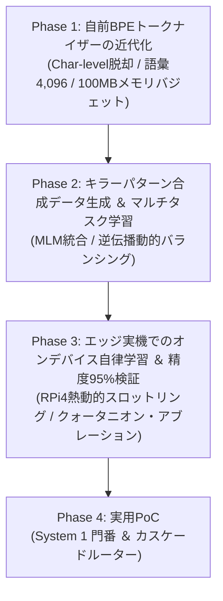
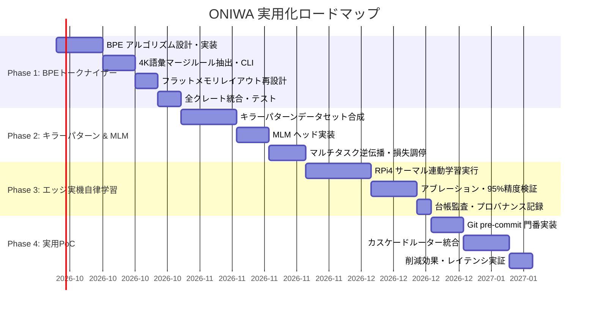

# 🌿 ONIWA 実用化ロードマップ仕様書 (System 1 & System 2 統合展開)

<p align="left">
  <a href="10_system_integration_roadmap.md">English</a> | <b>日本語</b>
</p>

> **策定日**: 2026年9月22日  
> **位置付け**: `docs/09_roadmap`（学術的クォータニオン研究ロードマップ）に続く、実用化・システム統合（System 1 × System 2）展開仕様書  
> **対象環境**: Raspberry Pi 4（ARM Cortex-A72 4コア, 1〜4GB RAM, 消費電力 ~3.5W〜5W）

---

## 1. 概要と基本方針

本プロジェクトは、ビッグテックの大規模データセンター型LLMに対抗し、数W・数十MBの極小エッジ環境（Raspberry Pi等）で推論および自律学習（逆伝播）を完結させる型安全知能システムの実用化を目指す。

### 1.1 システム制約と達成目標

| 項目 | 制約・目標値 | 根拠・技術仕様 |
| :--- | :---: | :--- |
| **メモリフットプリント上限** | **100MB 以内** | 重み、勾配、AdamW 1次・2次モーメント状態、活性化値（T=128）の総和 |
| **依存関係の原則** | **Pure Rust (Zero-Dep)** | 外部MLクレート、Python/PyTorch/CUDAランタイムを完全排除 |
| **監査透明性** | **100% Provenance** | 訓練データ・ビルド環境・コミット・重みSHA-256を台帳（`ledger_index.jsonl`）に記録 |
| **数理的特徴** | **クォータニオン代数** | ハミルトン積によるパラメータ4倍圧縮、語順・構造の非可換性表現、ARM NEON SIMD最適化 |
| **推論レイテンシ** | **~100ms 台** | NEON SIMD化により、RPi4実機で即時応答（Gatekeeper判定）を実現 |
| **消費エネルギー** | **~0.4J / 推論** | 平均3.5W稼働時における1回推論あたりの消費エネルギー極小化 |
| **判定タスク総合精度** | **95% 以上** | キラーパターン検知・異常検出における実用レベルの信頼性 |

---

## 2. フェーズ別マイルストーン詳細



---

### Phase 1: 自前BPEトークナイザーの近代化（最優先）

- **目的**:  
  文字単位（Char-level）によるコンテキスト長不足（日本語128文字 ≒ 1〜2文程度）を解消し、系列長 $T=128$ での情報密度を3〜4倍に拡張する。
- **主要タスク**:
  1. **Pure Rust かつゼロ外部依存の Byte-level BPE アルゴリズム設計**:
     - 256バイトの生バイト表現を基底語彙とし、頻出ペアを逐次マージする決定論的エンコーダ/デコーダの実装。
     - 未知語（OOV: Out-Of-Vocabulary）クラッシュを数学的にゼロ化。
  2. **語彙サイズ $V = 4,096$ のマージルール学習器（CLIツール）の実装**:
     - `oniwa-pipeline` 内の清浄コーパス（青空文庫、e-Gov法令、技術文書、クリーンコード）からマージテーブルを抽出・固定。
  3. **平坦メモリ（フラットバッファ）レイアウトの再計算**:
     - 語彙拡張に伴う Embedding 層およびオプティマイザ状態のメモリバジェット厳守。
  4. **クレート間統合と動作検証**:
     - `oniwa-pipeline`, `oniwa-decide`, `oniwa-lm` への統合とラウンドトリップ可逆性テスト。
- **メモリバジェット算定（$V = 4,096, d_{\text{model}} = 256$, `f32`）**:
  - Embedding 重み: $4,096 \times 256 \times 4\text{B} \approx 4.19\text{ MB}$
  - Embedding 勾配: $4.19\text{ MB}$
  - Embedding AdamW 状態 ($m, v$): $4.19\text{ MB} \times 2 = 8.39\text{ MB}$
  - **Embedding層 合計**: 約 **16.78 MB**
  - バックボーン（4層 Transformer + Head + オプティマイザ状態 + 活性化値）: 約 **15〜25 MB**
  - **総メモリ消費**: 約 **32〜42 MB** $\ll$ **上限 100 MB**（十分な安全域を確保）
- **成功基準**:
  - 系列長 $T=128$ で一般的な日本語テキスト 350 文字以上、または完全なソースコード関数ブロック全体を保持可能。
  - トークナイズ/デトークナイズの完全可逆性（Roundtrip 100%一致）。
  - 最大常駐メモリ（RSS）が 100MB の枠組みに厳格に収まること。

---

### Phase 2: キラーパターン合成データ生成 ＆ マルチタスク学習（MLM統合）

- **目的**:  
  正規表現やAST（抽象構文木）パーサー等の静的解析では検知できない「意味的ねじれ・文脈依存の論理異常」を捉える基礎文脈理解力を獲得する。
- **主要タスク**:
  1. **フロンティアモデルを活用した「キラーパターン」データセット（1〜5万件）の体系的合成**:
     - **論理・意味のデッドロック**: AST構文としては正当だが、関数名・Docコメントの契約と内部実装が正反対（例: `is_authenticated()` が常に `true` を返す等）。
     - **文脈依存のセマンティック機密漏洩**: 変数名難読化や文字列結合を介した間接的トークン流出。
     - **語順・非可換性が崩れたコード・文章差分**: トランザクション処理やロック取得順序の逆転による潜在的競合。
  2. **`oniwa-decide` への Masked Language Modeling (MLM) ヘッド追加**:
     - BERT型双方向マスク復元ヘッド（$15\%$ のトークンをマスクし復元）を導入。
  3. **マルチタスク逆伝播エンジンの実装と損失バランシング**:
     - 局所トークン復元損失（$\mathcal{L}_{\text{MLM}}$）と文全体決定損失（Choice, Noul, Score）の統合：
       $$\mathcal{L}_{\text{total}} = \alpha \mathcal{L}_{\text{MLM}} + \beta \mathcal{L}_{\text{choice}} + \gamma \mathcal{L}_{\text{noul}} + \delta \mathcal{L}_{\text{score}}$$
     - 勾配衝突を防ぐ動的重み付けスケジューリング（初期はMLM重視で表現学習、後半に決定タスクへファインチューン）。
- **成功基準**:
  - 勾配衝突（Gradient Interference）を起こさず、MLM損失と決定損失（Choice/Noul/Score）が安定して同時に減少すること。
  - 静的解析がパスしてしまうキラーパターンに対する検知率が有意に向上すること。

---

### Phase 3: エッジ実機でのオンデバイス自律学習 ＆ 精度95%検証

- **目的**:  
  外部クラウドやGPUサーバーに一切依存せず、低電力エッジ実機（Raspberry Pi 4）上で手元データによる自己教師ありバックプロパゲーションを完結させる。
- **主要タスク**:
  1. **実機環境（Raspberry Pi 4）での熱動的スロットリング連動学習ループ**:
     - `/sys/class/thermal/thermal_zone0/temp` 監視と連動し、高温時（例: $>75^\circ\text{C}$）に動的クールダウン・バックオフを自動適用。
  2. **テストデータセットにおける決定精度の厳密評価**:
     - Choice（4クラス分類）、Noul（構文・意味異常検知）、Score（複雑性・信頼度回帰）の3軸で評価。
  3. **クォータニオン表現と実数表現のアブレーション比較**:
     - 同一パラメータ数（Iso-parameter）および同一次元数（Iso-dimension）条件下での学習速度・収束損失・メモリ効率の比較検証。
  4. **完全監査台帳（Ledger）への記録**:
     - エッジ実機で生成・更新された重みチェックサム（SHA-256）を `logs/ledger_index.jsonl` に厳格に追記。
- **成功基準**:
  - サーマルスロットリング制御下で、熱暴走（Thermal Throttling Halt）や OOM クラッシュを起こさずに数万ステップの自己学習を完走。
  - Choice・Noul 判定精度において **95% 以上** を達成。

---

### Phase 4: 実用PoC（System 1 門番 ＆ カスケードルーター）

- **目的**:  
  単なるベンチマーク評価を超え、実開発環境・エッジシステムに組み込める「型安全な超高速門番」および「カスケードルーター」を完成させる。
- **主要タスク**:
  1. **Git pre-commit セキュリティ＆構文門番 (Gatekeeper CLI)**:
     - ステージングされたコード差分を 0.1 秒台（$\sim 100\text{ms}$）で走査。
     - セマンティック欠陥・キラーパターンを型安全に検知し、コミットを即時ブロック。
  2. **カスケード型ハイブリッド・ルーター (`SemanticSensor` 統合)**:
     - 入力クエリ・コードを `oniwa-decide`（System 1）で即座に走査。
     - **判定分岐ロジック**:
       - `Verdict::Allow`: 定型・安全・低難易度の処理を即時パス。
       - `Verdict::Reject(Reason)`: 異常・欠陥を極小レイテンシで即座に遮断。
       - `Verdict::Escalate`: 高難易度・長文思考・生成が必要な場合のみ `oniwa-lm`（System 2）または外部大規模モデルへディスパッチ。
- **型安全インターフェース想定**:
  ```rust
  #[derive(Debug, Clone, PartialEq)]
  pub enum RoutingDecision {
      /// System 1 で即時解決（低難易度・安全）
      FastPath(ChoiceVerdict),
      /// 異常検知により即時遮断（セキュリティ・構文欠陥）
      Block { reason: AnomalyReport },
      /// System 2 (oniwa-lm / 外部LLM) への高度推論エスカレーション
      EscalateToSystemTwo { context_entropy: f32 },
  }
  ```
- **成功基準**:
  - 開発ワークフローを阻害しない極小オーバーヘッド（$<100\text{ms}$）での実働。
  - クラウド生成モデルの呼び出し頻度・電力・APIコストを **90% 以上削減**。

---

## 3. ガントチャート・進捗管理


