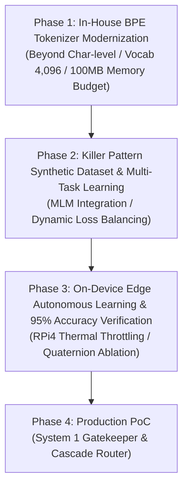
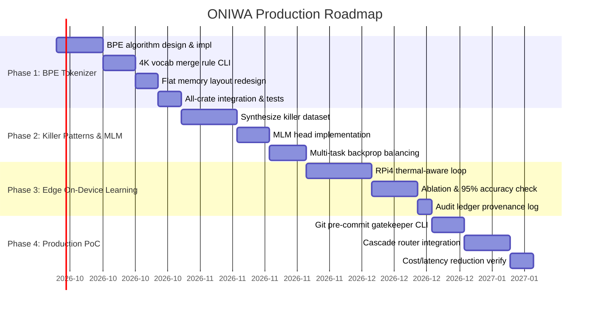

# 🌿 ONIWA Production Roadmap Specification (System 1 & System 2 Integration)

<p align="left">
  <b>English</b> | <a href="10_system_integration_roadmap.ja.md">日本語 (Japanese)</a>
</p>

> **Created**: September 22, 2026  
> **Positioning**: Practical production and system integration (System 1 × System 2) roadmap specification following `docs/09_roadmap.md` (academic quaternion research)  
> **Target Environment**: Raspberry Pi 4 (ARM Cortex-A72 4-core, 1–4GB RAM, Power consumption ~3.5W–5W)

---

## 1. Overview and Core Principles

This project aims to commercialize and deploy a type-safe intelligence system capable of completing inference and autonomous learning (backpropagation) entirely on minimal edge hardware (~few watts, tens of megabytes), countering big-tech centralized hyperscale LLMs.

### 1.1 System Constraints and Target Metrics

| Item | Constraint / Target | Technical Specification / Rationale |
| :--- | :---: | :--- |
| **Memory Footprint Upper Bound** | **$\le 100\text{ MB}$** | Total sum of weights, gradients, AdamW 1st/2nd moments, and activation values ($T=128$) |
| **Dependency Principle** | **Pure Rust (Zero-Dep)** | Complete elimination of external ML crates, Python, PyTorch, and CUDA runtimes |
| **Audit Transparency** | **100% Provenance** | Training data, build environment, commit hash, and weight SHA-256 checksums logged in `ledger_index.jsonl` |
| **Mathematical Characteristics** | **Quaternion Algebra** | $4\times$ parameter compression via Hamilton product, non-commutative sequence representation, ARM NEON SIMD optimization |
| **Inference Latency** | **~100ms range** | Instant edge response (Gatekeeper verdict) on physical Raspberry Pi 4 via NEON SIMD |
| **Energy Consumption** | **~0.4J / inference** | Minimal energy per forward pass under ~3.5W average operating power |
| **Decision Task Accuracy** | **$\ge 95\%$** | Production-ready reliability across killer pattern detection and anomaly classification |

---

## 2. Detailed Phase Milestones



---

### Phase 1: In-House BPE Tokenizer Modernization (Top Priority)

- **Objective**:  
  Overcome the context window limitation of character-level tokenization (128 Japanese chars $\approx$ 1–2 sentences) and expand information density by $3\times$ to $4\times$ at sequence length $T=128$.
- **Key Tasks**:
  1. **Pure Rust Zero-Dependency Byte-Level BPE Algorithm Design**:
     - Base vocabulary initialized with 256 raw byte representations; deterministic encoder/decoder with sequential pair merging.
     - Out-Of-Vocabulary (OOV) crashes mathematically guaranteed to be impossible.
  2. **Vocabulary Size $V = 4,096$ Merge Rule Learner (CLI Tool)**:
     - Extract and freeze merge tables from clean corpora in `oniwa-pipeline` (Aozora Bunko, e-Gov legislation, technical documentation, clean source code).
  3. **Flat Memory Layout Recalculation**:
     - Ensure strict adherence to memory budgets for the expanded embedding table and optimizer states.
  4. **Cross-Crate Integration and Verification**:
     - Integrate into `oniwa-pipeline`, `oniwa-decide`, and `oniwa-lm` with 100% roundtrip reversibility tests.
- **Memory Budget Estimation ($V = 4,096, d_{\text{model}} = 256$, `f32`)**:
  - Embedding Weights: $4,096 \times 256 \times 4\text{B} \approx 4.19\text{ MB}$
  - Embedding Gradients: $4.19\text{ MB}$
  - Embedding AdamW States ($m, v$): $4.19\text{ MB} \times 2 = 8.39\text{ MB}$
  - **Embedding Layer Total**: $\approx \mathbf{16.78\text{ MB}}$
  - Backbone (4-layer Transformer + Head + Optimizer States + Activations): $\approx \mathbf{15\text{–}25\text{ MB}}$
  - **Total Memory Usage**: $\approx \mathbf{32\text{–}42\text{ MB}} \ll \mathbf{100\text{ MB}}$ (Ample headroom maintained)
- **Success Criteria**:
  - Maintain $\ge 350$ standard Japanese characters or complete code function blocks within $T=128$.
  - 100% loss-free roundtrip tokenization and detokenization.
  - Maximum Resident Set Size (RSS) strictly within 100MB.

---

### Phase 2: Killer Pattern Synthetic Dataset & Multi-Task Learning (MLM Integration)

- **Objective**:  
  Acquire semantic context comprehension capable of capturing semantic incoherence and context-dependent logical anomalies that static analysis (regex, AST parsers) cannot detect.
- **Key Tasks**:
  1. **Systematic Synthesis of "Killer Pattern" Dataset (10K–50K samples) via Frontier Models**:
     - **Logical/Semantic Deadlocks**: Valid AST syntax, but contradictory semantics between function contracts/docstrings and implementation (e.g., `is_authenticated()` returning constant `true`).
     - **Context-Dependent Semantic Leaks**: Indirect credential/token leakage through obfuscated identifiers or string concatenations.
     - **Non-Commutative Disordering**: Potential race conditions caused by inverted transaction operations or lock acquisition ordering.
  2. **Add Masked Language Modeling (MLM) Head to `oniwa-decide`**:
     - Implement BERT-style bidirectional mask reconstruction head (masking $15\%$ of tokens).
  3. **Multi-Task Backpropagation Engine & Loss Balancing**:
     - Unified loss formulation integrating local mask restoration ($\mathcal{L}_{\text{MLM}}$) and global decision targets (Choice, Noul, Score):
       $$\mathcal{L}_{\text{total}} = \alpha \mathcal{L}_{\text{MLM}} + \beta \mathcal{L}_{\text{choice}} + \gamma \mathcal{L}_{\text{noul}} + \delta \mathcal{L}_{\text{score}}$$
     - Dynamic scheduling to avoid gradient interference (prioritize representation learning with MLM early, fine-tuning decision heads later).
- **Success Criteria**:
  - Simultaneous, stable convergence of both MLM loss and decision losses without gradient collision.
  - Significant detection rate improvements on killer patterns that pass static analysis.

---

### Phase 3: On-Device Edge Autonomous Learning & 95% Accuracy Verification

- **Objective**:  
  Complete self-supervised edge backpropagation on local data using physical Raspberry Pi 4 hardware without external GPU/cloud dependencies.
- **Key Tasks**:
  1. **Thermal Dynamic Throttling-Aware Training Loop on RPi4**:
     - Monitor `/sys/class/thermal/thermal_zone0/temp` and dynamically trigger cool-down backoff when temperatures exceed threshold (e.g., $>75^\circ\text{C}$).
  2. **Rigorous Decision Evaluation on Test Benchmarks**:
     - Comprehensive evaluation across Choice (4-class classification), Noul (syntax/semantic anomaly detection), and Score (complexity/confidence regression).
  3. **Quaternion vs. Real-Valued Baseline Ablation**:
     - Comparative analysis under iso-parameter and iso-dimension conditions for convergence speed, loss minima, and cache locality.
  4. **Full Audit Ledger Recording**:
     - Record all edge-trained model weight checksums (SHA-256) and training telemetry into `logs/ledger_index.jsonl`.
- **Success Criteria**:
  - Complete tens of thousands of self-training steps under thermal throttling control without overheating halts or OOM crashes.
  - Achieve $\ge \mathbf{95\%}$ decision accuracy across Choice and Noul evaluation sets.

---

### Phase 4: Production PoC (System 1 Gatekeeper & Cascade Router)

- **Objective**:  
  Move beyond benchmark validation to establish an ultra-fast, type-safe gatekeeper and cascade router integrated into practical developer workflows.
- **Key Tasks**:
  1. **Git Pre-Commit Security & Syntax Gatekeeper CLI**:
     - Scan staged code changes in ~100ms.
     - Detect semantic defects and killer patterns in a type-safe manner, halting commits on violation.
  2. **Cascade Hybrid Router (`SemanticSensor` Integration)**:
     - Scan input queries/code with `oniwa-decide` (System 1) immediately.
     - **Routing Logic**:
       - `Verdict::Allow`: Immediately pass low-complexity, safe operations.
       - `Verdict::Reject(Reason)`: Block anomalies and security defects with minimal latency.
       - `Verdict::Escalate`: Dispatch to `oniwa-lm` (System 2) or external large models only when complex synthesis, deliberation, or generation is needed.
- **Type-Safe Routing Interface**:
  ```rust
  #[derive(Debug, Clone, PartialEq)]
  pub enum RoutingDecision {
      /// Resolved immediately by System 1 (fast path, safe)
      FastPath(ChoiceVerdict),
      /// Blocked immediately due to anomaly detection (security / semantic flaw)
      Block { reason: AnomalyReport },
      /// Escalated to System 2 (oniwa-lm / external LLM) for deliberate reasoning
      EscalateToSystemTwo { context_entropy: f32 },
  }
  ```
- **Success Criteria**:
  - Real-world execution with minimal developer overhead ($< 100\text{ms}$).
  - Reduce generative cloud model call frequency, power, and API costs by **$\ge 90\%$**.

---

## 3. Gantt Chart and Schedule


