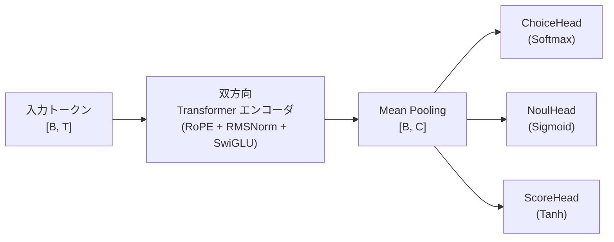
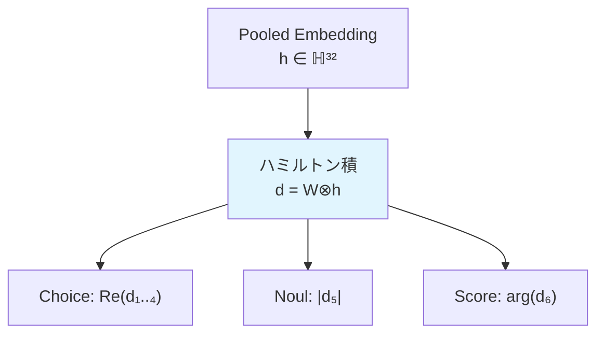
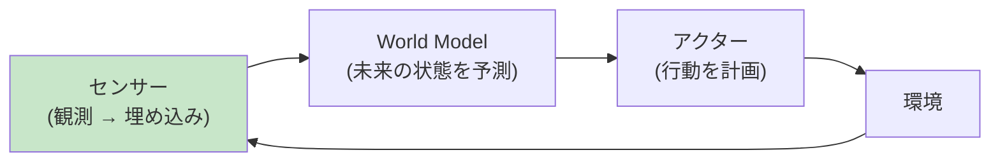
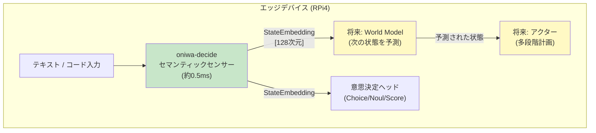
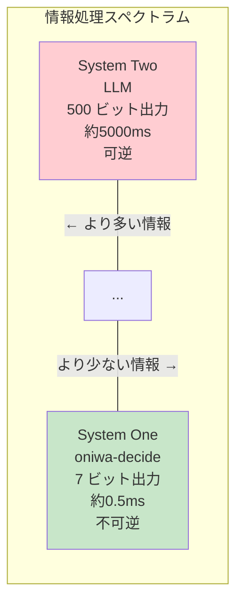
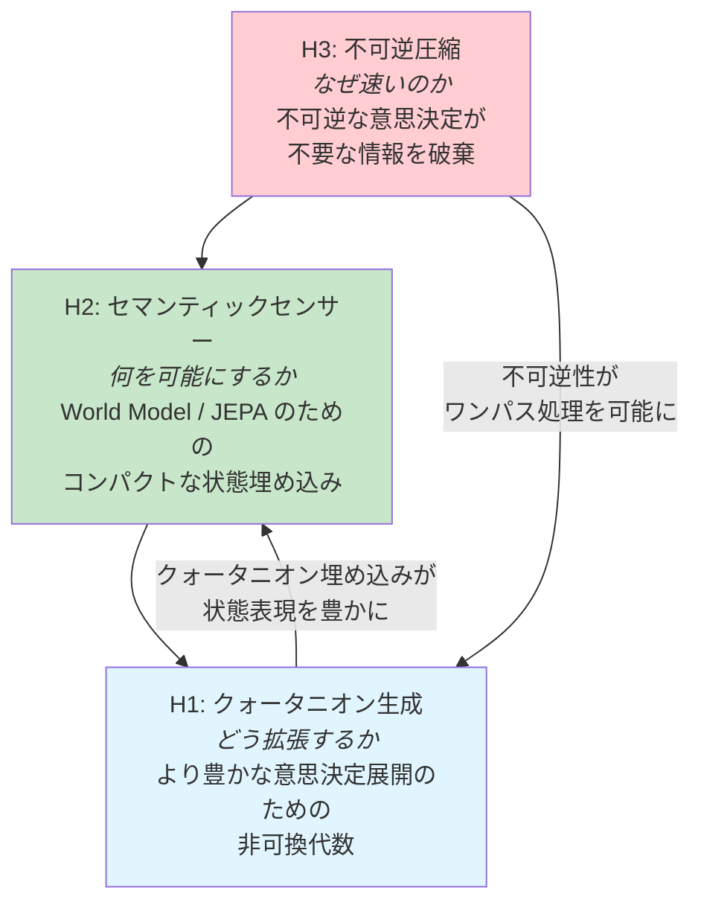

# System One 仮説: 設計ドキュメント

<p align="left">
  <a href="system-one-hypotheses.md">English</a> | <b>日本語</b>
</p>

> **ステータス**: ドラフト / リサーチ  
> **著者**: Kazuto Makino  
> **関連**: [oniwa-decide クレート](../../crates/oniwa-decide/), [プロジェクトマニフェスト](../00_oniwa-project-manifesto.ja.md)

---

## 1. はじめに

`oniwa-decide`（Pure Rust によるエッジ向け System One 意思決定エンジン）の開発過程で、AI アーキテクチャと物理学の交差点に位置する 3 つの研究仮説が浮上しました。本ドキュメントでは各仮説を形式化し、理論的基盤を探り、段階的な実装ロードマップを提案します。

### 1.1 oniwa-decide とは？

`oniwa-decide` は**双方向 Transformer エンコーダ**であり、自然言語やコードを 1 回のフォワードパスで取り込み、自己回帰的なテキスト生成を行わずに、直接実行可能な**型安全な意思決定**（Choice, Noul, Score）を出力します。Raspberry Pi 4 上でサブミリ秒の推論レイテンシで動作します。



**現在のアーキテクチャ**:
| パラメータ | 値 |
|-----------|-----|
| `dim` | 128 |
| `num_layers` | 4 |
| `num_heads` | 4 |
| `head_dim` | 32 |
| `ffn_dim` | 256 |
| `seq_len` | 128 |
| パラメータ数 | 約 890K |

### 1.2 三つの仮説

| # | 仮説 | コアアイデア |
|---|------|-------------|
| H1 | **クォータニオン生成** | 非可換代数（ハミルトン積）を用いた「ワンショット」多次元意思決定展開 |
| H2 | **セマンティックセンサー** | 生成を落とすことで、World Model / JEPA のための超効率的な「状態センサー」になる |
| H3 | **不可逆圧縮** | 意思決定は不可逆な情報圧縮であり、ゆえに超高速である |

これらの仮説は相互に関連しています。H3 は System One が*なぜ*速いかを説明し、H2 はそれが*何を可能にするか*を説明し、H1 は*どう拡張するか*を探求します。

---

## 2. 仮説 H1: クォータニオン生成

### 2.1 動機

従来の Transformer 埋め込みは実数ベクトル空間で動作し、すべての次元が可換（交換可能）です。しかし自然言語は**非可換構造**を持ちます：「犬が人を噛む」≠「人が犬を噛む」。**クォータニオン代数**がこの非対称性をネイティブに捉えられると仮定します。

### 2.2 背景: クォータニオン代数

クォータニオンは 4 次元の数です：

$$q = w + x\mathbf{i} + y\mathbf{j} + z\mathbf{k}$$

虚数単位は以下を満たします：

$$\mathbf{i}^2 = \mathbf{j}^2 = \mathbf{k}^2 = \mathbf{i}\mathbf{j}\mathbf{k} = -1$$

二つのクォータニオン $p = (p_w, p_x, p_y, p_z)$ と $q = (q_w, q_x, q_y, q_z)$ の**ハミルトン積**：

$$p \otimes q = \begin{pmatrix} p_w q_w - p_x q_x - p_y q_y - p_z q_z \\ p_w q_x + p_x q_w + p_y q_z - p_z q_y \\ p_w q_y - p_x q_z + p_y q_w + p_z q_x \\ p_w q_z + p_x q_y - p_y q_x + p_z q_w \end{pmatrix}$$

**重要な性質**: $p \otimes q \neq q \otimes p$（非可換性）— これは言語の語順依存性を反映しています。

### 2.3 クォータニオン埋め込みアーキテクチャ

トークン埋め込みを**クォータニオンの配列**として表現することを提案します。`dim = 128` の場合、各埋め込みは **32 個のクォータニオン**（128 / 4 = 32）になります：

```
従来:          e = [r₁, r₂, ..., r₁₂₈]           ∈ ℝ¹²⁸
クォータニオン:  e = [q₁, q₂, ..., q₃₂]             ∈ ℍ³²
               ここで qₖ = (wₖ, xₖ, yₖ, zₖ) ∈ ℍ
```

#### クォータニオン線形層

標準的な線形層 $y = Wx$ は、ハミルトン積を用いた**クォータニオン線形変換**になります：

$$\mathbf{y}_j = \sum_{i} \mathbf{W}_{ji} \otimes \mathbf{x}_i + \mathbf{b}_j$$

ここで $\mathbf{W}_{ji}, \mathbf{x}_i, \mathbf{b}_j \in \mathbb{H}$。

**パラメータ効率**: クォータニオン線形層は $n$ から $m$ クォータニオンへの変換に $4nm$ 個の実パラメータを必要としますが、ハミルトン積における成分間結合により**$16nm$ 個の実パラメータに相当する表現力**を持ちます。これにより約 **4 倍のパラメータ共有率**が得られます。

#### クォータニオン意思決定ヘッド

意思決定ヘッドはプーリングされたクォータニオン埋め込み $\mathbf{h} \in \mathbb{H}^{32}$ を受け取り、単一のハミルトン積回転によりすべての意思決定出力を同時に展開します：



**「ワンショット」の側面**: 三つの個別の線形射影（Choice: $W_c h$, Noul: $W_n h$, Score: $W_s h$）の代わりに、単一のクォータニオン重み行列 $\mathbf{W}_d \in \mathbb{H}^{6 \times 32}$ がハミルトン積 1 回ですべての意思決定出力を生成し、意思決定間の相関を本質的に捉えます。

### 2.4 具体例

文 "The code is clean" をトイサイズ `dim = 8`（トークンあたり 2 クォータニオン）でエンコードする場合：

```
トークン "code":  q₁ = (0.3, 0.1, -0.2, 0.5)   q₂ = (0.4, -0.1, 0.3, 0.2)
トークン "clean": q₁ = (0.2, 0.4, 0.1, -0.3)   q₂ = (0.5, 0.2, -0.1, 0.4)

意思決定重み: W = (0.1, -0.2, 0.3, 0.4)

W ⊗ q_code₁ = (0.1·0.3 - (-0.2)·0.1 - 0.3·(-0.2) - 0.4·0.5,  ...) = (0.31, ...)
q_code₁ ⊗ W = (0.3·0.1 - 0.1·(-0.2) - (-0.2)·0.3 - 0.5·0.4, ...) = (0.01, ...)
```

結果が**異なる**（0.31 vs 0.01）— これが非可換性の作用であり、トークンと意思決定の間の方向的関係をエンコードしています。

### 2.5 逆伝播: クォータニオン勾配

クォータニオン関数 $L(\mathbf{q})$（$\mathbf{q} = w + x\mathbf{i} + y\mathbf{j} + z\mathbf{k}$）の勾配は、**GHR（Generalized Hamilton-Real）微積分**を用いて成分ごとに計算されます：

$$\frac{\partial L}{\partial \mathbf{q}} = \frac{1}{4}\left(\frac{\partial L}{\partial w} - \frac{\partial L}{\partial x}\mathbf{i} - \frac{\partial L}{\partial y}\mathbf{j} - \frac{\partial L}{\partial z}\mathbf{k}\right)$$

ハミルトン積 $\mathbf{y} = \mathbf{p} \otimes \mathbf{x}$ の場合：

$$\frac{\partial L}{\partial \mathbf{x}} = \mathbf{p}^* \otimes \frac{\partial L}{\partial \mathbf{y}}, \quad \frac{\partial L}{\partial \mathbf{p}} = \frac{\partial L}{\partial \mathbf{y}} \otimes \mathbf{x}^*$$

ここで $\mathbf{q}^* = w - x\mathbf{i} - y\mathbf{j} - z\mathbf{k}$ はクォータニオン共役です。

### 2.6 Raspberry Pi 4 での計算コスト

| 演算 | 実数値 | クォータニオン | 備考 |
|------|--------|---------------|------|
| 線形変換 (128→128) | 16,384 MAC | 16,384 MAC | クォータニオン: 32→32、要素あたり 16 MAC |
| パラメータ数 | 16,384 | 4,096 | **4 倍削減** |
| メモリ (f32) | 64 KB | 16 KB | **4 倍削減** |
| 表現力 | 16K 自由度 | 約 16K 自由度 | 成分間結合により同等 |

クォータニオン版は**同数の浮動小数点演算**で **4 倍少ないパラメータ**を使用します — Raspberry Pi 4 の 1GB RAM 制約にとって大きな利点です。

---

## 3. 仮説 H2: セマンティックセンサー

### 3.1 動機

大規模言語モデル（LLM）はテキストをトークンごとに**生成**するために設計されています。この自己回帰的な生成は計算コストが高く（トークンあたり $O(n)$、$n$ トークン合計で $O(n^2)$）。しかし、生成が不要だとしたら？

`oniwa-decide` は意図的に**生成を省略**し、構造化された意思決定のみを出力します。これにより**超効率的な「センサー」**になるという仮説を立てます — 長いテキスト出力を構築するモジュールではなく、入力を読み取り理解してコンパクトな**状態表現**を生成するモジュールです。

### 3.2 JEPA（Joint Embedding Predictive Architecture）との接続

Yann LeCun の JEPA フレームワークは以下の World Model アーキテクチャを構想しています：



`oniwa-decide` の双方向エンコーダは自然に**センサー**の役割に適合します：

- **入力**: 生テキスト / コード（環境からの観測）
- **出力**: プーリングされた埋め込み $\mathbf{h} \in \mathbb{R}^{128}$（コンパクトな状態表現）
- **コスト**: 単一フォワードパス、RPi4 上で約 0.5ms

意思決定ヘッドは**すでに**この状態埋め込みの下流消費者です。追加の World Model モジュールは、センサーを変更することなく同じ埋め込みを消費できます。

### 3.3 提案するセンサー API

エンコーダのプーリング出力をファーストクラス API として公開することを提案します：

```rust
/// セマンティックセンサー: 生入力から状態埋め込みを生成
pub struct SemanticSensor {
    encoder: DecisionModel,
    tokenizer: CharTokenizer,
}

impl SemanticSensor {
    /// 入力テキストを状態埋め込みベクトルにエンコード
    pub fn sense(&self, input: &str) -> StateEmbedding {
        let tokens = self.tokenizer.encode(input);
        let cache = self.encoder.forward(&tokens, 1, self.encoder.config.seq_len);
        StateEmbedding {
            vector: cache.pooled,
            dim: self.encoder.config.dim,
            confidence: self.compute_confidence(&cache),
        }
    }
}

/// 下流 World Model のためのコンパクトな状態表現
pub struct StateEmbedding {
    pub vector: Vec<f32>,   // [dim] プーリングされたエンコーダ出力
    pub dim: usize,
    pub confidence: f32,    // 全体の埋め込み信頼度
}
```

### 3.4 効率比較

| システム | 操作 | レイテンシ (RPi4) | 出力 |
|---------|------|-------------------|------|
| GPT-2 (124M) | 50 トークン生成 | 約 5,000 ms | 自由形式テキスト |
| oniwa-lm (SLM) | 50 トークン生成 | 約 500 ms | 自由形式テキスト |
| **oniwa-decide** | **単一フォワードパス** | **約 0.5 ms** | **状態埋め込み + 意思決定** |

センサーは生成モデルより **10,000 倍高速**です。反復しないため — すべての入力情報を 1 パスで固定サイズの埋め込みに圧縮します。

### 3.5 統合ビジョン



---

## 4. 仮説 H3: 不可逆圧縮

### 4.1 動機

なぜ `oniwa-decide` は生成型 LLM よりもはるかに高速なのか？ その答えは**情報理論**にあると提案します：意思決定は**不可逆な非可逆圧縮**の行為です。

### 4.2 情報理論的フレームワーク

#### System Two（自己回帰 LLM）

LLM は完全な情報量を持つ出力 $Y = (y_1, y_2, ..., y_n)$ を生成します：

$$H(Y) = -\sum_{t=1}^{n} \log P(y_t \mid y_{<t})$$

これは**ほぼ可逆な**エンコーディングです：出力テキストは推論の連鎖を再構築するのに十分な情報を保持します。各トークンはモデルの完全なフォワードパスを必要とし、$O(n)$ のシーケンシャルステップになります。

#### System One（oniwa-decide）

`oniwa-decide` は大幅に削減された情報量の意思決定 $D = (\text{choice}, \text{noul}, \text{score})$ を出力します：

$$H(D) = H(\text{choice}) + H(\text{noul}) + H(\text{score})$$

4 選択肢の場合の具体的な値：
- $H(\text{choice}) \leq \log_2 4 = 2$ ビット
- $H(\text{noul}) \leq \log_2 2 = 1$ ビット
- $H(\text{score}) \approx 3\text{–}4$ ビット（連続値、離散化）

**合計**: $H(D) \leq 7$ ビット vs. 50 トークン応答の $H(Y) \approx 50 \times 10 = 500$ ビット。

#### 圧縮率

$$\text{圧縮率} = \frac{H(Y)}{H(D)} \approx \frac{500}{7} \approx 70\times$$

この圧縮は**非可逆かつ不可逆**です：選択インデックス、ブール値、スコアだけから完全なテキスト推論を再構築することはできません。しかし **System One タスク**（高速で直感的な判断）にとって、この破棄された情報は不要です。

### 4.3 速度・可逆性トレードオフ



これは**熱力学的矢印**を反映しています：不可逆プロセス（熱散逸、意思決定）は可逆プロセスよりも速く進行します。なぜなら、逆転のための情報を保存する必要がないからです。ランダウアーの原理に基づくと：

$$E_{\text{消去}} \geq k_B T \ln 2 \quad \text{（消去ビットあたり）}$$

非可逆圧縮中に破棄される各ビットの情報には最小限の熱力学的コスト（室温で約 $3 \times 10^{-21}$ J/ビット）がかかりますが、その情報を生成しなくて済む計算的節約と比較すると無視できます。

### 4.4 人間の認知との類似性

Daniel Kahneman のデュアルプロセス理論は直接的に対応します：

| | System 1（速い） | System 2（遅い） |
|---|---|---|
| **人間** | 直感、直感的判断 | 熟慮的推論 |
| **AI** | oniwa-decide（非可逆） | LLM（ほぼ可逆） |
| **情報** | 圧縮された意思決定 | 完全な推論の連鎖 |
| **速度** | 約 0.5ms | 約 5000ms |
| **可逆性** | 不可逆 | 可逆 |

---

## 5. 仮説間の相互関連

三つの仮説は、効率的なエッジ AI 意思決定の一貫した理論を形成します：



1. **H3 → H2**: 意思決定が非可逆（不可逆）であるため、エンコーダは生成のための情報保存ではなく、最良の**状態表現**の生成に完全に集中できます。
2. **H2 → H1**: 状態埋め込み（センサー出力）は、非可換演算がより豊かな構造的関係を捉えるため、クォータニオン表現から恩恵を受けます。
3. **H3 → H1**: 不可逆性はワンパス処理を可能にします — クォータニオンのハミルトン積は、「元に戻す」能力を保持する必要がないため、すべての意思決定を同時に展開できます。

---

## 6. 実装ロードマップ

### Phase 1: クォータニオン埋め込み層（近期）

**目標**: `oniwa-decide` の実数値線形層をクォータニオン線形層で置き換える。

| タスク | 説明 |
|--------|------|
| `quaternion.rs` | `Quaternion` 構造体の実装（ハミルトン積、共役、ノルム） |
| `quaternion_linear.rs` | `QuaternionLinear` 層の実装（フォワード + バックワード） |
| 統合 | 埋め込み層と意思決定ヘッド層の置き換え |
| ベンチマーク | パラメータ数、推論レイテンシ、意思決定精度の比較 |

**期待される成果**: 同等以上の精度で約 4 倍のパラメータ削減。

### Phase 2: セマンティックセンサー API（中期）

**目標**: `oniwa-decide` のエンコーダ出力をファーストクラスの状態埋め込み API として公開する。

| タスク | 説明 |
|--------|------|
| `sensor.rs` | `SemanticSensor` 構造体と `StateEmbedding` 型の実装 |
| API 設計 | 下流消費者のための `sense()` インターフェースの定義 |
| 埋め込み品質 | クラスタリングと類似度メトリクスによる埋め込み品質の評価 |
| ドキュメント | World Model 統合の可能性のためのセンサー API 文書化 |

**期待される成果**: 将来の World Model 開発を可能にするクリーンで文書化された API。

### Phase 3: 不可逆圧縮の検証（長期）

**目標**: 情報理論的フレームワークの実験的検証。

| タスク | 説明 |
|--------|------|
| エントロピー測定 | $H(D)$ を計算し、同等タスクの推定 $H(Y)$ と比較 |
| 速度-情報曲線 | 設定ごとの意思決定レイテンシ vs 情報量をプロット |
| アブレーション研究 | 情報をさらに圧縮した場合の精度低下を測定 |
| 正式な論文化 | 実験結果に基づく理論的フレームワークの精緻化 |

**期待される成果**: 不可逆圧縮仮説を支持する実証的証拠。

---

## 7. 参考文献

- Hamilton, W.R. (1843). *On a new Species of Imaginary Quantities connected with a Theory of Quaternions.*
- Parcollet, T. et al. (2019). *Quaternion Recurrent Neural Networks.* ICLR 2019.
- Zhu, X. et al. (2018). *Quaternion Convolutional Neural Networks.* ECCV 2018.
- Kahneman, D. (2011). *Thinking, Fast and Slow.* Farrar, Straus and Giroux.（邦題：ファスト&スロー）
- LeCun, Y. (2022). *A Path Towards Autonomous Machine Intelligence.* （JEPA フレームワーク）
- Landauer, R. (1961). *Irreversibility and Heat Generation in the Computing Process.* IBM Journal.
- TypeSafe AI. (2025). *Jev: The System One AI Model.*

---

## 付録 A: クォータニオン・ハミルトン積 — Rust 擬似コード

```rust
/// クォータニオン q = w + xi + yj + zk
#[derive(Clone, Copy, Debug)]
pub struct Quaternion {
    pub w: f32,
    pub x: f32,
    pub y: f32,
    pub z: f32,
}

impl Quaternion {
    /// ハミルトン積: self ⊗ other（非可換）
    pub fn hamilton_product(&self, other: &Quaternion) -> Quaternion {
        Quaternion {
            w: self.w * other.w - self.x * other.x - self.y * other.y - self.z * other.z,
            x: self.w * other.x + self.x * other.w + self.y * other.z - self.z * other.y,
            y: self.w * other.y - self.x * other.z + self.y * other.w + self.z * other.x,
            z: self.w * other.z + self.x * other.y - self.y * other.x + self.z * other.w,
        }
    }

    /// 共役: q* = w - xi - yj - zk
    pub fn conjugate(&self) -> Quaternion {
        Quaternion { w: self.w, x: -self.x, y: -self.y, z: -self.z }
    }

    /// ノルム: |q| = sqrt(w² + x² + y² + z²)
    pub fn norm(&self) -> f32 {
        (self.w * self.w + self.x * self.x + self.y * self.y + self.z * self.z).sqrt()
    }
}
```

---

*本ドキュメントは [ONIWA プロジェクト](../../README.ja.md)の一部です — 100% 出自証明を備えた、オーガニックでエッジ展開可能な知性を育みます。*
