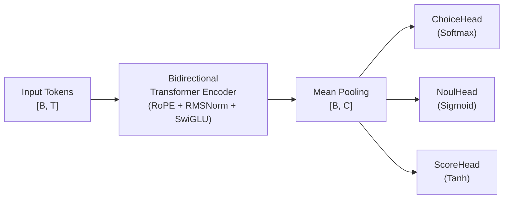
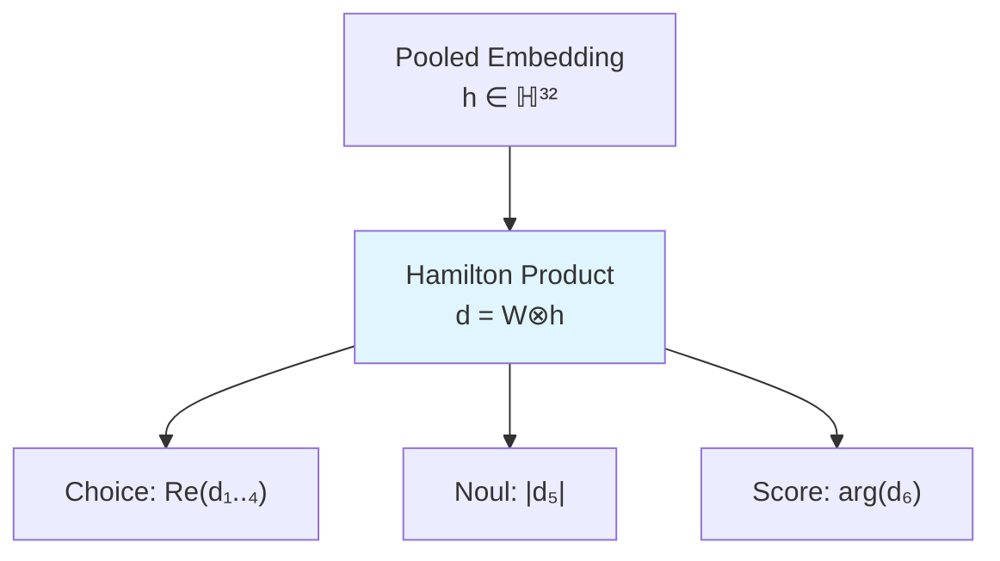
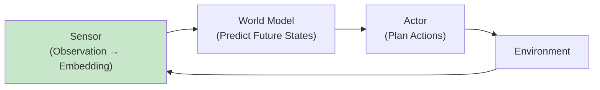
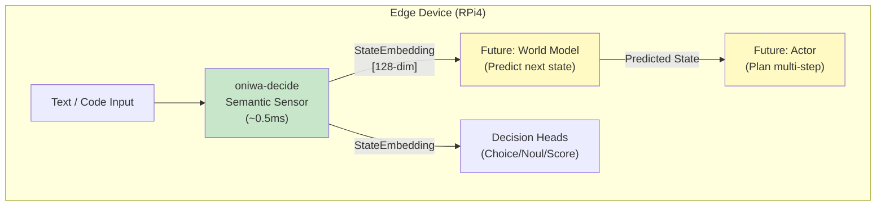
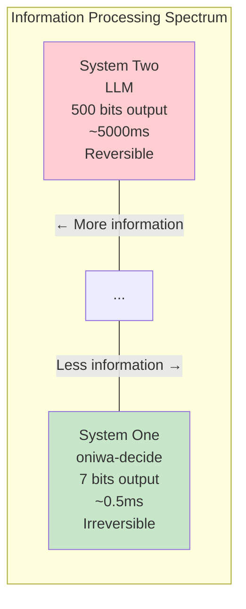
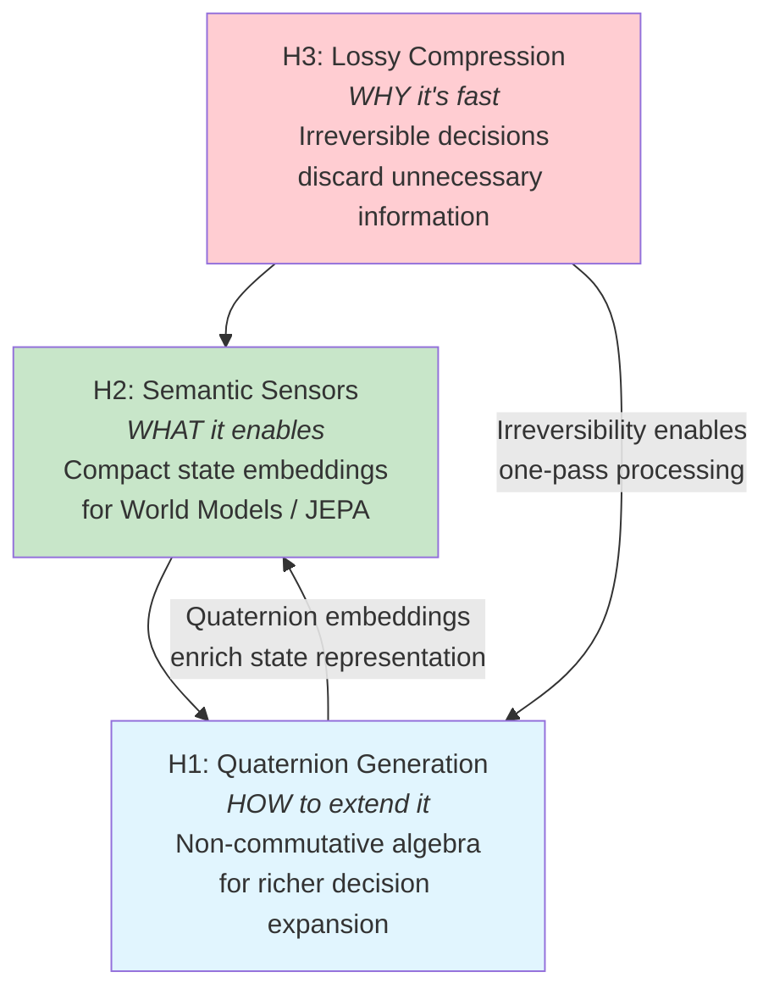

# System One Hypotheses: Design Document

<p align="left">
  <b>English</b> | <a href="system-one-hypotheses.ja.md">日本語 (Japanese)</a>
</p>

> **Status**: Draft / Research  
> **Authors**: Kazuto Makino  
> **Related**: [oniwa-decide crate](../../crates/oniwa-decide/), [Project Manifesto](../00_oniwa-project-manifesto.md)

---

## 1. Introduction

During the development of `oniwa-decide` — a Pure-Rust, edge-deployable System One decision engine — three research hypotheses emerged at the intersection of AI architecture and physics. This document formalizes each hypothesis, explores its theoretical foundations, and proposes a phased implementation roadmap.

### 1.1 Context: What is oniwa-decide?

`oniwa-decide` is a **bidirectional Transformer encoder** that ingests natural language or code in a single forward pass and outputs directly executable **typed decisions** (Choice, Noul, Score) — without autoregressive text generation. It runs on a Raspberry Pi 4 with sub-millisecond inference latency.



**Current Architecture**:
| Parameter | Value |
|-----------|-------|
| `dim` | 128 |
| `num_layers` | 4 |
| `num_heads` | 4 |
| `head_dim` | 32 |
| `ffn_dim` | 256 |
| `seq_len` | 128 |
| Parameters | ~890K |

### 1.2 The Three Hypotheses

| # | Hypothesis | Core Idea |
|---|-----------|-----------|
| H1 | **Quaternion Generation** | Use non-commutative algebra (Hamilton product) to enable "one-shot" multi-dimensional decision expansion |
| H2 | **Semantic Sensors** | Dropping generation makes it a hyper-efficient "state sensor" for World Models / JEPA |
| H3 | **Lossy Compression** | Decisions are irreversible information compression, hence ultra-fast |

These hypotheses are interconnected — H3 explains *why* System One is fast, H2 explains *what it enables*, and H1 explores *how to extend it*.

---

## 2. Hypothesis H1: Quaternion Generation

### 2.1 Motivation

Traditional Transformer embeddings operate in real-valued vector spaces where all dimensions are commutative (interchangeable). Natural language, however, exhibits **non-commutative structure**: "dog bites man" ≠ "man bites dog". We hypothesize that **quaternion algebra** can natively capture this asymmetry.

### 2.2 Background: Quaternion Algebra

A quaternion is a 4-dimensional number:

$$q = w + x\mathbf{i} + y\mathbf{j} + z\mathbf{k}$$

where the imaginary units satisfy:

$$\mathbf{i}^2 = \mathbf{j}^2 = \mathbf{k}^2 = \mathbf{i}\mathbf{j}\mathbf{k} = -1$$

The **Hamilton product** of two quaternions $p = (p_w, p_x, p_y, p_z)$ and $q = (q_w, q_x, q_y, q_z)$:

$$p \otimes q = \begin{pmatrix} p_w q_w - p_x q_x - p_y q_y - p_z q_z \\ p_w q_x + p_x q_w + p_y q_z - p_z q_y \\ p_w q_y - p_x q_z + p_y q_w + p_z q_x \\ p_w q_z + p_x q_y - p_y q_x + p_z q_w \end{pmatrix}$$

**Key property**: $p \otimes q \neq q \otimes p$ (non-commutativity) — this mirrors the order-dependence of language.

### 2.3 Quaternion Embedding Architecture

We propose representing token embeddings as **arrays of quaternions**. With `dim = 128`, each embedding becomes **32 quaternions** (128 / 4 = 32):

```
Traditional:  e = [r₁, r₂, ..., r₁₂₈]           ∈ ℝ¹²⁸
Quaternion:   e = [q₁, q₂, ..., q₃₂]             ∈ ℍ³²
              where qₖ = (wₖ, xₖ, yₖ, zₖ) ∈ ℍ
```

#### Quaternion Linear Layer

A standard linear layer $y = Wx$ becomes a **quaternion linear transformation** using the Hamilton product:

$$\mathbf{y}_j = \sum_{i} \mathbf{W}_{ji} \otimes \mathbf{x}_i + \mathbf{b}_j$$

where $\mathbf{W}_{ji}, \mathbf{x}_i, \mathbf{b}_j \in \mathbb{H}$.

**Parameter efficiency**: A quaternion linear layer from $n$ to $m$ quaternions requires $4nm$ real parameters but captures the **expressiveness of $16nm$ real parameters** due to the inter-component coupling in Hamilton products. This yields an approximate **4× parameter sharing factor**.

#### Quaternion Decision Heads

The decision heads receive the pooled quaternion embedding $\mathbf{h} \in \mathbb{H}^{32}$ and apply a single Hamilton product rotation to expand all decision outputs simultaneously:



The **"one-shot"** aspect: instead of three separate linear projections (Choice: $W_c h$, Noul: $W_n h$, Score: $W_s h$), a single quaternion weight matrix $\mathbf{W}_d \in \mathbb{H}^{6 \times 32}$ produces all decision outputs via one Hamilton product, inherently capturing inter-decision correlations.

### 2.4 Concrete Example

Consider encoding the sentence "The code is clean" with a toy `dim = 8` (2 quaternions per token):

```
Token "code":  q₁ = (0.3, 0.1, -0.2, 0.5)   q₂ = (0.4, -0.1, 0.3, 0.2)
Token "clean": q₁ = (0.2, 0.4, 0.1, -0.3)   q₂ = (0.5, 0.2, -0.1, 0.4)

Decision weight: W = (0.1, -0.2, 0.3, 0.4)

W ⊗ q_code₁ = (0.1·0.3 - (-0.2)·0.1 - 0.3·(-0.2) - 0.4·0.5,  ...) = (0.31, ...)
q_code₁ ⊗ W = (0.3·0.1 - 0.1·(-0.2) - (-0.2)·0.3 - 0.5·0.4, ...) = (0.01, ...)
```

The results **differ** (0.31 vs 0.01) — this is the non-commutativity at work, encoding directional relationships between tokens and decisions.

### 2.5 Backward Pass: Quaternion Gradients

For a quaternion function $L(\mathbf{q})$ where $\mathbf{q} = w + x\mathbf{i} + y\mathbf{j} + z\mathbf{k}$, the gradient is computed component-wise using the **GHR (Generalized Hamilton-Real) calculus**:

$$\frac{\partial L}{\partial \mathbf{q}} = \frac{1}{4}\left(\frac{\partial L}{\partial w} - \frac{\partial L}{\partial x}\mathbf{i} - \frac{\partial L}{\partial y}\mathbf{j} - \frac{\partial L}{\partial z}\mathbf{k}\right)$$

For the Hamilton product $\mathbf{y} = \mathbf{p} \otimes \mathbf{x}$:

$$\frac{\partial L}{\partial \mathbf{x}} = \mathbf{p}^* \otimes \frac{\partial L}{\partial \mathbf{y}}, \quad \frac{\partial L}{\partial \mathbf{p}} = \frac{\partial L}{\partial \mathbf{y}} \otimes \mathbf{x}^*$$

where $\mathbf{q}^* = w - x\mathbf{i} - y\mathbf{j} - z\mathbf{k}$ is the quaternion conjugate.

### 2.6 Computational Cost on Raspberry Pi 4

| Operation | Real-valued | Quaternion | Notes |
|-----------|-------------|------------|-------|
| Linear (128→128) | 16,384 MACs | 16,384 MACs | Quaternion: 32→32 but 16 MACs/element |
| Parameters | 16,384 | 4,096 | **4× reduction** |
| Memory (f32) | 64 KB | 16 KB | **4× reduction** |
| Expressiveness | 16K DOF | ~16K DOF | Similar thanks to inter-component coupling |

The quaternion version uses the **same number of floating-point operations** but with **4× fewer parameters** — a significant advantage for the 1GB RAM constraint of Raspberry Pi 4.

---

## 3. Hypothesis H2: Semantic Sensors

### 3.1 Motivation

Large Language Models (LLMs) are designed to **generate** text token-by-token. This autoregressive generation is computationally expensive ($O(n)$ per token, $O(n^2)$ total for $n$ tokens). But what if generation is unnecessary?

`oniwa-decide` deliberately **drops generation** and outputs only structured decisions. We hypothesize that this makes it a **hyper-efficient "sensor"** — a module that reads and comprehends input to produce a compact **state representation**, rather than a module that constructs lengthy text outputs.

### 3.2 Connection to JEPA (Joint Embedding Predictive Architecture)

Yann LeCun's JEPA framework envisions a World Model architecture where:



`oniwa-decide`'s bidirectional encoder naturally fits the **Sensor** role:

- **Input**: Raw text/code (observation from the environment)
- **Output**: Pooled embedding $\mathbf{h} \in \mathbb{R}^{128}$ (compact state representation)
- **Cost**: Single forward pass, ~0.5ms on RPi4

The decision heads are **already** downstream consumers of this state embedding. Additional World Model modules could consume the same embedding without modifying the Sensor.

### 3.3 Proposed Sensor API

We propose exposing the encoder's pooled output as a first-class API:

```rust
/// Semantic Sensor: produces a state embedding from raw input
pub struct SemanticSensor {
    encoder: DecisionModel,
    tokenizer: CharTokenizer,
}

impl SemanticSensor {
    /// Encode input text into a state embedding vector
    pub fn sense(&self, input: &str) -> StateEmbedding {
        let tokens = self.tokenizer.encode(input);
        let cache = self.encoder.forward(&tokens, 1, self.encoder.config.seq_len);
        StateEmbedding {
            vector: cache.pooled,
            dim: self.encoder.config.dim,
            confidence: self.compute_confidence(&cache),
        }
    }
}

/// Compact state representation for downstream World Models
pub struct StateEmbedding {
    pub vector: Vec<f32>,   // [dim] pooled encoder output
    pub dim: usize,
    pub confidence: f32,    // overall embedding confidence
}
```

### 3.4 Efficiency Comparison

| System | Operation | Latency (RPi4) | Output |
|--------|-----------|----------------|--------|
| GPT-2 (124M) | Generate 50 tokens | ~5,000 ms | Free-form text |
| oniwa-lm (SLM) | Generate 50 tokens | ~500 ms | Free-form text |
| **oniwa-decide** | **Single forward pass** | **~0.5 ms** | **State embedding + decisions** |

The Sensor is **10,000× faster** than a generative model because it does not iterate — it compresses all input information into a fixed-size embedding in one pass.

### 3.5 Integration Vision



---

## 4. Hypothesis H3: Lossy Compression

### 4.1 Motivation

Why is `oniwa-decide` so much faster than a generative LLM? We propose that the answer lies in **information theory**: a decision is an act of **irreversible lossy compression**.

### 4.2 Information-Theoretic Framework

#### System Two (Autoregressive LLM)

An LLM produces output $Y = (y_1, y_2, ..., y_n)$ with full information content:

$$H(Y) = -\sum_{t=1}^{n} \log P(y_t \mid y_{<t})$$

This is a **near-lossless** encoding: the output text preserves enough information to reconstruct the reasoning chain. Each token requires a full forward pass through the model, giving $O(n)$ sequential steps.

#### System One (oniwa-decide)

`oniwa-decide` produces a decision $D = (\text{choice}, \text{noul}, \text{score})$ with greatly reduced information content:

$$H(D) = H(\text{choice}) + H(\text{noul}) + H(\text{score})$$

For concrete values with 4 choices:
- $H(\text{choice}) \leq \log_2 4 = 2$ bits
- $H(\text{noul}) \leq \log_2 2 = 1$ bit  
- $H(\text{score}) \approx 3\text{–}4$ bits (continuous, discretized)

**Total**: $H(D) \leq 7$ bits vs. $H(Y) \approx 50 \times 10 = 500$ bits for a 50-token response.

#### The Compression Ratio

$$\text{Compression Ratio} = \frac{H(Y)}{H(D)} \approx \frac{500}{7} \approx 70\times$$

This compression is **lossy and irreversible**: you cannot reconstruct the full textual reasoning from just a choice index, a boolean, and a score. But for **System One tasks** (fast, intuitive judgments), this discarded information is unnecessary.

### 4.3 The Speed–Reversibility Tradeoff



This mirrors the **thermodynamic arrow**: irreversible processes (heat dissipation, decision-making) proceed faster than reversible ones, because they don't need to preserve information for reversal. Drawing from Landauer's principle:

$$E_{\text{erasure}} \geq k_B T \ln 2 \quad \text{per bit erased}$$

Each bit of information discarded during lossy compression has a minimum thermodynamic cost — but this cost is negligible (~$3 \times 10^{-21}$ J/bit at room temperature) compared to the computational savings from not having to generate that information.

### 4.4 Analogy to Human Cognition

Daniel Kahneman's dual-process theory maps directly:

| | System 1 (Fast) | System 2 (Slow) |
|---|---|---|
| **Human** | Intuition, gut feeling | Deliberate reasoning |
| **AI** | oniwa-decide (lossy) | LLM (near-lossless) |
| **Information** | Compressed decision | Full reasoning chain |
| **Speed** | ~0.5ms | ~5000ms |
| **Reversibility** | Irreversible | Reversible |

---

## 5. Interconnections

The three hypotheses form a coherent theory of efficient edge-AI decision-making:



1. **H3 → H2**: Because decisions are lossy (irreversible), the encoder can focus entirely on producing the best possible **state representation** rather than preserving information for generation.
2. **H2 → H1**: The state embedding (Sensor output) benefits from quaternion representation because non-commutative operations capture richer structural relationships.
3. **H3 → H1**: Irreversibility enables one-pass processing — quaternion Hamilton products can expand all decisions simultaneously because there is no need to preserve the ability to "undo" them.

---

## 6. Implementation Roadmap

### Phase 1: Quaternion Embedding Layer (Near-term)

**Goal**: Replace real-valued linear layers with quaternion linear layers in `oniwa-decide`.

| Task | Description |
|------|-------------|
| `quaternion.rs` | Implement `Quaternion` struct with Hamilton product, conjugate, norm |
| `quaternion_linear.rs` | Implement `QuaternionLinear` layer (forward + backward) |
| Integration | Replace embedding and decision head layers |
| Benchmark | Compare parameter count, inference latency, and decision accuracy |

**Expected outcome**: ~4× parameter reduction with comparable or improved accuracy.

### Phase 2: Semantic Sensor API (Mid-term)

**Goal**: Expose `oniwa-decide`'s encoder output as a first-class state embedding API.

| Task | Description |
|------|-------------|
| `sensor.rs` | Implement `SemanticSensor` struct and `StateEmbedding` type |
| API design | Define the `sense()` interface for downstream consumers |
| Embedding quality | Evaluate embedding quality via clustering and similarity metrics |
| Documentation | Document the Sensor API for potential World Model integration |

**Expected outcome**: A clean, documented API that enables future World Model development.

### Phase 3: Lossy Compression Verification (Long-term)

**Goal**: Experimentally verify the information-theoretic framework.

| Task | Description |
|------|-------------|
| Entropy measurement | Compute $H(D)$ and compare with estimated $H(Y)$ for equivalent tasks |
| Speed-information curve | Plot decision latency vs. information content across configurations |
| Ablation study | Measure accuracy degradation as information is further compressed |
| Formal writeup | Refine the theoretical framework based on experimental results |

**Expected outcome**: Empirical evidence supporting the lossy compression hypothesis.

---

## 7. References

- Hamilton, W.R. (1843). *On a new Species of Imaginary Quantities connected with a Theory of Quaternions.*
- Parcollet, T. et al. (2019). *Quaternion Recurrent Neural Networks.* ICLR 2019.
- Zhu, X. et al. (2018). *Quaternion Convolutional Neural Networks.* ECCV 2018.
- Kahneman, D. (2011). *Thinking, Fast and Slow.* Farrar, Straus and Giroux.
- LeCun, Y. (2022). *A Path Towards Autonomous Machine Intelligence.* (JEPA framework)
- Landauer, R. (1961). *Irreversibility and Heat Generation in the Computing Process.* IBM Journal.
- TypeSafe AI. (2025). *Jev: The System One AI Model.*

---

## Appendix A: Quaternion Hamilton Product — Rust Pseudocode

```rust
/// A quaternion q = w + xi + yj + zk
#[derive(Clone, Copy, Debug)]
pub struct Quaternion {
    pub w: f32,
    pub x: f32,
    pub y: f32,
    pub z: f32,
}

impl Quaternion {
    /// Hamilton product: self ⊗ other (non-commutative)
    pub fn hamilton_product(&self, other: &Quaternion) -> Quaternion {
        Quaternion {
            w: self.w * other.w - self.x * other.x - self.y * other.y - self.z * other.z,
            x: self.w * other.x + self.x * other.w + self.y * other.z - self.z * other.y,
            y: self.w * other.y - self.x * other.z + self.y * other.w + self.z * other.x,
            z: self.w * other.z + self.x * other.y - self.y * other.x + self.z * other.w,
        }
    }

    /// Conjugate: q* = w - xi - yj - zk
    pub fn conjugate(&self) -> Quaternion {
        Quaternion { w: self.w, x: -self.x, y: -self.y, z: -self.z }
    }

    /// Norm: |q| = sqrt(w² + x² + y² + z²)
    pub fn norm(&self) -> f32 {
        (self.w * self.w + self.x * self.x + self.y * self.y + self.z * self.z).sqrt()
    }
}
```

---

*This document is part of the [ONIWA project](../../README.md) — cultivating organic, edge-deployable intelligence with 100% provenance.*
